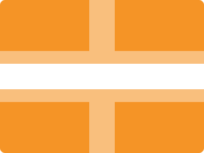

# CSS Battle Daily Targets: 19/06/2024

### Daily Targets to Solve

  
[see the daily target](https://cssbattle.dev/play/oXHWuJP1uyAlP66lqvFq)  
Check out the solution video on [YouTube](https://www.youtube.com/watch?v=0hNl0B_tr4g)

### Stats

**Match**: 100%  
**Score**: 693.95{152}

### Code

```html
<p>
<style>
  body {
    margin: 0;
    background: #F59426;
    display: flex;
    justify-content: center;
    align-items: center;
    height: 100vh;
  }
  p {
    width: 150px;
    height: 150px;
    background: #FFF;
    border: 25px solid #F9BF7D;
    box-shadow: 0 0 0 175px #F9BF7D;
    border-radius: 50%;
  }
</style>
```

### Code Explanation

- **Global Styles (`body`)**:
  - **Margin**: Removes the default margin to ensure the layout is flush with the viewport edges.
  - **Background Color**: Sets the background color of the entire page to `#F59426`, a shade of orange.
  - **Display**: Uses `flex` to center the content.
  - **Justify-content and Align-items**: Centers the content horizontally and vertically within the viewport.
  - **Height**: Sets the height of the viewport to `100vh`, ensuring the flexbox centering works correctly.

- **Styles for `<p>` Tag**:
  - **Width and Height**: Sets the dimensions of the `<p>` element to `150px` by `150px`, creating a square.
  - **Background Color**: Sets the background color to `#FFF`, white.
  - **Border**: Adds a `25px` solid border with the color `#F9BF7D`, a light tan shade.
  - **Box-shadow**: Creates an outer layer with the same color as the border, extending `175px` outwards to match the visual design.
  - **Border-radius**: Applies a border radius of `50%`, making the element circular.

This setup creates a visual design with an orange background and a central white circle with a thick tan border, matching the desired target image. The use of flexbox ensures the element is centered precisely in the viewport.