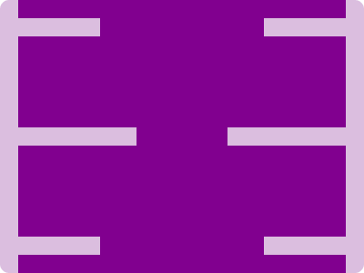

# CSS Battle Daily Targets: 25/06/2024

### Daily Targets to Solve

  
[see the daily target](https://cssbattle.dev/play/qKIRr3xZYc2T6RJLdmSy)  
Check out the solution video on [YouTube](https://www.youtube.com/watch?v=lQd8aLBf8U0)

### Stats

**Match**: 100%  
**Score**: 669.92{183}

### Code

```html
<p>
<style>
*{
  background:#DBBEDF;
  +*{
    background:#81008F;
    margin:0 20
  }
}
  p{
    position:fixed;
    padding:10+80;
    margin:20-70;
    color:DBBEDF;
    box-shadow:340px 0,40px 120px,300px 120px,0 240px,340px 240px
  }
</style>
```

### Code Explanation

- **Global Styles (`*`)**:
  - **Background Color**: Sets the background color of the entire page to `#DBBEDF`, a light lavender shade.

- **Nested `*` Selector**:
  - **Background Color**: Sets the background color of the nested elements to `#81008F`, a dark purple shade.
  - **Margin**: Sets the margin of the nested elements to `0 20px` (0 for top and bottom, 20px for left and right).

- **Styles for `<p>` Tag**:
  - **Position**: Uses `fixed` to position the element relative to the viewport.
  - **Padding**: Adds padding of `10px` top/bottom and `80px` left/right, controlling the size of the element.
  - **Margin**: Sets the margin to `20px` top, `-70px` right, `20px` bottom, and `-70px` left to adjust its position.
  - **Color**: Sets the text color to `#DBBEDF`, making the text invisible as it matches the background color.
  - **Box-shadow**: Creates multiple shadows to form the additional shapes around the central element:
    - `340px 0`: A shadow positioned `340px` to the right.
    - `40px 120px`: A shadow positioned `40px` to the right and `120px` down.
    - `300px 120px`: A shadow positioned `300px` to the right and `120px` down.
    - `0 240px`: A shadow positioned `240px` down.
    - `340px 240px`: A shadow positioned `340px` to the right and `240px` down.

This setup creates a visual design with a light lavender background and several dark purple rectangles positioned around a central rectangle, matching the desired target image. The use of fixed positioning, padding, and box shadows ensures precise placement of the elements to achieve the required visual effect.