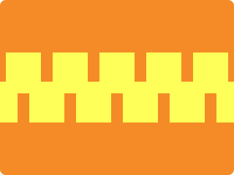

# CSS Battle Daily Targets: 29/06/2024

### Daily Targets to Solve

  
[see the daily target](https://cssbattle.dev/play/pOqAtr2UeRY6Eo1zEqv5)  
Check out the solution video on [YouTube](https://www.youtube.com/watch?v=9FI19I685Ko)

### Stats

**Match**: 100%  
**Score**: 666.03{189}

### Code

```html
<style>
*+*{
    background:#FEFF58;
    margin:90 330 140 10;
    color:FEFF58;
    box-shadow:80px 0,160px 0,240px 0,320px 0,-40px 50px,40px 50px,120px 50px,200px 50px,280px 50px,360px 50px,0 0 0 400px#F48B26
  }
</style>
```

### Code Explanation

- **Universal Selector (`*+*`)**:
  - **Background Color**: Sets the background color of all elements that are adjacent to another element to `#FEFF58`, a yellow shade.
  - **Margin**: Sets the margin of these elements to `90px` on top, `330px` on the right, `140px` on the bottom, and `10px` on the left.
  - **Color**: Sets the color of the text to `#FEFF58`, making the text invisible as it matches the background color.
  - **Box-shadow**: Creates multiple shadows to form the additional shapes around the central element:
    - `80px 0`: A shadow positioned `80px` to the right.
    - `160px 0`: A shadow positioned `160px` to the right.
    - `240px 0`: A shadow positioned `240px` to the right.
    - `320px 0`: A shadow positioned `320px` to the right.
    - `-40px 50px`: A shadow positioned `40px` to the left and `50px` down.
    - `40px 50px`: A shadow positioned `40px` to the right and `50px` down.
    - `120px 50px`: A shadow positioned `120px` to the right and `50px` down.
    - `200px 50px`: A shadow positioned `200px` to the right and `50px` down.
    - `280px 50px`: A shadow positioned `280px` to the right and `50px` down.
    - `360px 50px`: A shadow positioned `360px` to the right and `50px` down.
    - `0 0 0 400px #F48B26`: A shadow with a spread radius of `400px` and color `#F48B26`, an orange shade, around the entire setup.

This setup creates a visual design with a yellow background and several yellow rectangles positioned around a central orange rectangle, matching the desired target image. The use of margins and box shadows ensures precise placement of the elements to achieve the required visual effect.