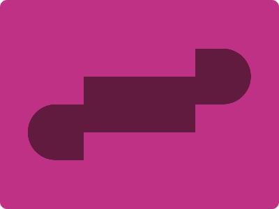

# CSS Battle Daily Targets: 03/07/2024

### Daily Targets to Solve

  
[see the daily target](https://cssbattle.dev/play/qSR7vqyfPi8bGODtqPy6)  
Check out the solution video on [YouTube](https://www.youtube.com/watch?v=drb8AchIy-s)

### Stats

**Match**: 100%  
**Score**: 683{165}

### Code

```html
<p><a>
<style>
*{
  background:#BE3184;
  *{
    background:#611B3F;
    margin:110 120
  }
}
  p,a{
    position:fixed;
    padding:40;
    margin:40-80;
    border-radius:50q 0 0 50q
  }
  a{
    scale:-1;
    margin:-120 200
  }
</style>
```

### Code Explanation

- **Universal Selector (`*`)**:
  - **Background Color**: Sets the background color of the entire page to `#BE3184`, a deep pink shade.

- **Nested `*` Selector**:
  - **Background Color**: Sets the background color of the nested elements to `#611B3F`, a dark maroon shade.
  - **Margin**: Sets the margin of the nested elements to `110px` top/bottom and `120px` left/right.

- **Styles for `p` and `a` Tags**:
  - **Position**: Uses `fixed` to position the elements relative to the viewport, ensuring they stay in place as the page is scrolled.
  - **Padding**: Adds padding of `40px` to control the size of the elements.
  - **Margin**: Positions the elements using margin, set to `40px` top and `-80px` left/right.
  - **Border-radius**: Sets the border-radius to `50q 0 0 50q`, creating a quarter-circle shape.

- **Styles for `a` Tag**:
  - **Scale**: Flips the element horizontally by setting `scale` to `-1`.
  - **Margin**: Adjusts the margin to `-120px` top and `200px` left/right to fine-tune its position.

This setup creates a visual design with a deep pink background and several maroon quarter-circles positioned around the page, matching the desired target image. The use of fixed positioning, padding, border-radius, and margin ensures precise placement of the elements to achieve the required visual effect.