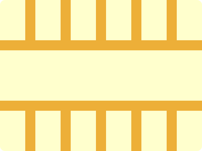

# CSS Battle Daily Targets: 10/07/2024

### Daily Targets to Solve

  
[see the daily target](https://cssbattle.dev/play/OxDGfLWJZc8pz1ViVMqf)  
Check out the solution video on [YouTube](https://www.youtube.com/watch?v=ZyAixGXRysQ)

### Stats

**Match**: 100%  
**Score**: 652.03{214}

### Code

```html
<p><a>
<style>
*{
  background:#EDAF38;
  *{
    background:#FFFFCD;
    margin:100 0
  }
}
  p,a{
    position:absolute
  }
  a{
    padding:40+25;
    margin:20 0;
    color:FFFFCD;
    box-shadow:70px 0,140px 0,210px 0,280px 0,350px 0
  }
  p{
    -webkit-box-reflect:above 100px
  }
</style>
```

### Code Explanation

- **Universal Selector (`*`)**:
  - **Background Color**: Sets the background color of the entire page to `#EDAF38`, a golden orange shade.

- **Nested Universal Selector (`*` inside `*`)**:
  - **Background Color**: Sets the background color of the nested elements to `#FFFFCD`, a pale yellow shade.
  - **Margin**: Sets the margin of the nested elements to `100px` top and bottom, and `0px` left and right.

- **Styles for `p` and `a` Tags**:
  - **Position**: Uses `absolute` to position the elements relative to the nearest positioned ancestor.

- **Styles for `a` Tag**:
  - **Padding**: Adds padding of `40px + 25px` to control the size of the element.
  - **Margin**: Positions the element using a margin of `20px` top and bottom, and `0px` left and right.
  - **Color**: Sets the color of the text to `#FFFFCD`, matching the background color of the nested elements to make the text invisible.
  - **Box-shadow**: Creates multiple shadows to form the additional shapes around the central element:
    - `70px 0`: A shadow positioned `70px` to the right.
    - `140px 0`: A shadow positioned `140px` to the right.
    - `210px 0`: A shadow positioned `210px` to the right.
    - `280px 0`: A shadow positioned `280px` to the right.
    - `350px 0`: A shadow positioned `350px` to the right.

- **Styles for `p` Tag**:
  - **-webkit-box-reflect**: Uses the `-webkit-box-reflect` property to create a reflection effect, with the reflection appearing `100px` above the element.

This setup creates a visual design with a golden orange background and several pale yellow shapes positioned around the page, matching the desired target image. The use of absolute positioning, padding, margin, color, box-shadow, and box-reflect ensures precise placement of the elements to achieve the required visual effect.