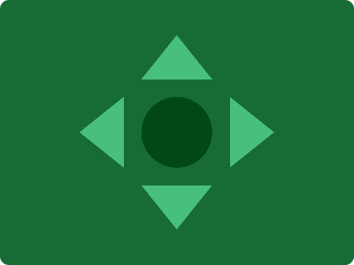

# CSS Battle Daily Targets: 11/07/2024

### Daily Targets to Solve

  
[see the daily target](https://cssbattle.dev/play/jF7qZRcYICI3uTe3mUFn)  
Check out the solution video on [YouTube](https://www.youtube.com/watch?v=Aaut72XIxcw)

### Stats

**Match**: 100%  
**Score**: 633.88{259}

### Code

```html
<p><a><p a><a>
<style>
*{
  background:#176C36;
  +*{
    background:#024817;
    border-radius:50%;
    margin:110 160
  }
}
  a{
    position:fixed;
    background:#48BF7D;
    padding:25+40;
    margin:-70 0;
    clip-path:polygon(50%0,0%100%,100%100%)
  }
  p{
    -webkit-box-reflect:below 80px
  }
  [a]{
    rotate:90deg;
    margin:80
  }
</style>
```

### Code Explanation

- **Universal Selector (`*`)**:
  - **Background Color**: Sets the background color of the entire page to `#176C36`, a dark green shade.
  - **Adjacent Sibling Universal Selector (`+*`)**: Targets all elements that are immediate siblings of any element.
    - **Background Color**: Sets the background color of these sibling elements to `#024817`, a darker green shade.
    - **Border-radius**: Sets the `border-radius` to `50%`, making these sibling elements circular.
    - **Margin**: Sets the margin of these sibling elements to `110px` top and bottom, and `160px` left and right.

- **Styles for `a` Tag**:
  - **Position**: Uses `fixed` to position the elements relative to the viewport, ensuring they stay in place as the page is scrolled.
  - **Background Color**: Sets the background color to `#48BF7D`, a lighter green shade.
  - **Padding**: Adds combined padding of `25px` and `40px` to control the size of the element.
  - **Margin**: Positions the element using a margin of `-70px` top and bottom, and `0px` left and right.
  - **Clip-path**: Uses the `polygon` function to clip the element into a triangle shape.

- **Styles for `p` Tag**:
  - **-webkit-box-reflect**: Uses the `-webkit-box-reflect` property to create a reflection effect, with the reflection appearing `80px` below the element.

- **Styles for `[a]` Attribute Selector**:
  - **Rotate**: Rotates the element by `90deg`.
  - **Margin**: Sets the margin of this element to `80px` on all sides. 

This setup creates a visual design with a dark green background and several green shapes positioned around the page, matching the desired target image. The use of fixed positioning, padding, margin, clip-path, rotation, and reflection ensures precise placement of the elements to achieve the required visual effect.