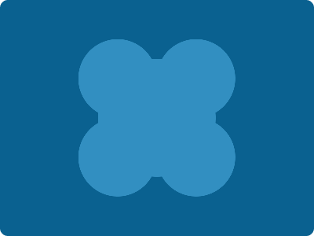

# CSS Battle Daily Targets: 14/07/2024

### Daily Targets to Solve

  
[see the daily target](https://cssbattle.dev/play/m1cHlo8crbGrZEPvie07)  
Check out the solution video on [YouTube](https://www.youtube.com/watch?v=y06Qh1Hm6Ik)

### Stats

**Match**: 100%  
**Score**: 674.74{176}

### Code

```html
<style>
*{
  background:#0A6190;
  *{
    background:#328FC1;
    margin:75 125;
    border-radius:50%;
    color:328FC1;
    box-shadow:-50px -50px 0-25px,50px -50px 0-25px,-50px 50px 0-25px,50px 50px 0-25px
  }
}
</style>
```

### Code Explanation

- **Universal Selector (`*`)**:
  - **Background Color**: Sets the background color of the entire page to `#0A6190`, a deep blue shade.

- **Nested Universal Selector (`*` inside `*`)**:
  - **Background Color**: Sets the background color of the nested elements to `#328FC1`, a lighter blue shade.
  - **Margin**: Sets the margin of the nested elements to `75px` top and bottom, and `125px` left and right.
  - **Border-radius**: Sets the `border-radius` to `50%`, making these nested elements circular.
  - **Color**: Sets the text color to `#328FC1`, matching the background color of the nested elements to make the text invisible.
  - **Box-shadow**: Creates multiple shadows to form the additional shapes around the central element:
    - `-50px -50px 0 -25px`: A shadow positioned `50px` to the left and `50px` up, with a spread radius of `-25px`.
    - `50px -50px 0 -25px`: A shadow positioned `50px` to the right and `50px` up, with a spread radius of `-25px`.
    - `-50px 50px 0 -25px`: A shadow positioned `50px` to the left and `50px` down, with a spread radius of `-25px`.
    - `50px 50px 0 -25px`: A shadow positioned `50px` to the right and `50px` down, with a spread radius of `-25px`.

This setup creates a visual design with a deep blue background and several light blue circular shapes positioned around the page, matching the desired target image. The use of margin, border-radius, and box-shadow ensures precise placement of the elements to achieve the required visual effect.