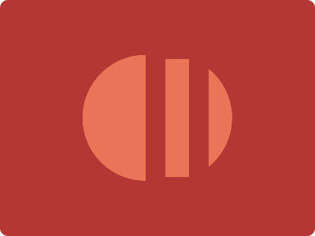

# CSS Battle Daily Targets: 15/07/2024

### Daily Targets to Solve

  
[see the daily target](https://cssbattle.dev/play/63FIG5VojdN2a8llcruA)  
Check out the solution video on [YouTube](https://www.youtube.com/watch?v=Jrbo8pOiTH0)

### Stats

**Match**: 100%  
**Score**: 689.58{157}

### Code

```html
<p>
<style>
*{
  background:#B53733;
  *{
    background:#EA7457;
    margin:70 105
  }
  +*{
    border-radius:80px
  }
}
  p{
    position:fixed;
    border:25px solid#B53733;
    padding:75+15;
    margin:-20 80
  }
</style>
```

### Code Explanation

- **Universal Selector (`*`)**:
  - **Background Color**: Sets the background color of the entire page to `#B53733`, a reddish shade.
  - **Nested Universal Selector (`*` inside `*`)**:
    - **Background Color**: Sets the background color of the nested elements to `#EA7457`, a lighter orange-red shade.
    - **Margin**: Sets the margin of the nested elements to `70px` top and bottom, and `105px` left and right.
  - **Adjacent Sibling Universal Selector (`+*`)**:
    - **Border-radius**: Sets the `border-radius` to `80px`, giving the adjacent sibling elements rounded corners.

- **Styles for `p` Tag**:
  - **Position**: Uses `fixed` to position the element relative to the viewport, ensuring it stays in place as the page is scrolled.
  - **Border**: Adds a border of `25px` solid `#B53733`, the same color as the background.
  - **Padding**: Adds combined padding of `75px` and `15px` to control the size of the element.
  - **Margin**: Positions the element using a margin of `-20px` top/bottom and `80px` left/right.

This setup creates a visual design with a reddish background and a fixed-position element with a solid border and padding, matching the desired target image. The use of margin, border-radius, and fixed positioning ensures precise placement of the elements to achieve the required visual effect.