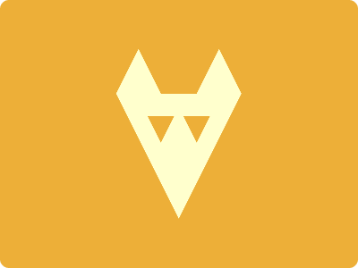

# CSS Battle Daily Targets: 17/07/2024

### Daily Targets to Solve

  
[see the daily target](https://cssbattle.dev/play/63uT8mAsvJRLBjA2dsct)  
Check out the solution video on [YouTube](https://www.youtube.com/watch?v=XGeBf1AiY1A)

### Stats

**Match**: 100%  
**Score**: 636.92{250}

### Code

```html
<p><p a>
<style>
*{
  background:#EDAF38;
  *{
    background:#FFFFCD;
    margin:55 130;
    clip-path:polygon(36%26.5%,64%26.5%,82%0,100%26%,50%100%,0%26%,18%0)
  }
}
  p{
    position:fixed;
    background:#EDAF38;
    padding:15;
    margin:75 35;
    clip-path:polygon(100%0,0%0,50%100%)
  }
  [a]{
    margin:75
  }
</style>
```

### Code Explanation

- **Universal Selector (`*`)**:
  - **Background Color**: Sets the background color of the entire page to `#EDAF38`, a golden orange shade.

- **Nested Universal Selector (`*` inside `*`)**:
  - **Background Color**: Sets the background color of the nested elements to `#FFFFCD`, a pale yellow shade.
  - **Margin**: Sets the margin of the nested elements to `55px` top and bottom, and `130px` left and right.
  - **Clip-path**: Uses the `polygon` function to clip the nested elements into a specific shape, resembling a star-like polygon with points defined by coordinates.

- **Styles for `p` Tag**:
  - **Position**: Uses `fixed` to position the `p` elements relative to the viewport, ensuring they stay in place as the page is scrolled.
  - **Background Color**: Sets the background color of the `p` elements to `#EDAF38`, matching the background color of the page.
  - **Padding**: Adds `15px` padding to control the size of the `p` elements.
  - **Margin**: Sets the margin of the `p` elements to `75px` top and bottom, and `35px` left and right.
  - **Clip-path**: Uses the `polygon` function to clip the `p` elements into a triangular shape with points defined by coordinates `(100%, 0)`, `(0, 0)`, and `(50%, 100%)`.

- **Styles for `[a]` Attribute Selector**:
  - **Margin**: Sets the margin of the elements with the attribute `a` to `75px` on all sides.

This setup creates a visual design with a golden orange background and several pale yellow star-like shapes and a triangular shape positioned around the page, matching the desired target image. The use of fixed positioning, padding, margin, and clip-path ensures precise placement of the elements to achieve the required visual effect.