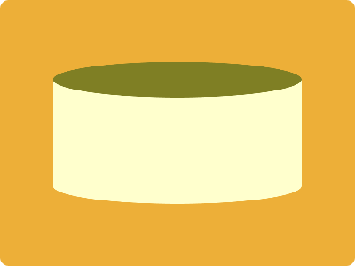

# CSS Battle Daily Targets: 24/07/2024

### Daily Targets to Solve

  
[see the daily target](https://cssbattle.dev/play/bHBi3b1NZkqOkTSGiK55)  
Check out the solution video on [YouTube](https://www.youtube.com/watch?v=I9JYjJjsIgw)

### Stats

**Match**: 100%  
**Score**: 692.17{154}

### Code

```html
<p>
<style>
*{
  background:#EDAF38;
  *{
    background:#FFFFCD;
    margin:90 60
  }
}
  p{
    position:fixed;
    padding:20+140;
    border-radius:50%;
    margin:100 0;
    box-shadow:0 -120px#7F7F24
  }
</style>
```

### Code Explanation

- **Universal Selector (`*`)**:
  - **Background Color**: Sets the background color of the entire page to `#EDAF38`, a shade of orange.

- **Nested Universal Selector (`* *`)**:
  - **Background Color**: Sets the background color of the nested elements to `#FFFFCD`, a pale yellow shade.
  - **Margin**: Sets the margin of the nested elements to `90px` top and bottom, and `60px` left and right.

- **Styles for `p` Tag**:
  - **Position**: Uses `fixed` to position the `p` element relative to the viewport, ensuring it stays in place as the page is scrolled.
  - **Padding**: Adds padding of `20px` on all sides plus `140px` on the left and right to control the size and shape of the element.
  - **Border-radius**: Sets the `border-radius` to `50%`, creating a circular shape.
  - **Margin**: Sets the margin of the `p` element to `100px` top and bottom, and `0` left and right.
  - **Box-shadow**: Creates a shadow with the value `0 -120px #7F7F24`, positioning the shadow `120px` above the element with a color of `#7F7F24`, a dark shade of greenish-yellow.

This setup creates a visual design with an orange background and a series of pale yellow circular shapes positioned around the page, matching the desired target image. The use of fixed positioning, padding, margin, border-radius, and box-shadow ensures precise placement and styling of the elements to achieve the required visual effect.