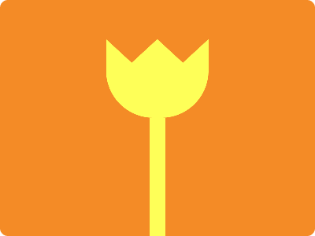

# CSS Battle Daily Targets: 27/07/2024

### Daily Targets to Solve

  
[see the daily target](https://cssbattle.dev/play/iNl2xqdjFtj96v8e9S7D)  
Check out the solution video on [YouTube](https://www.youtube.com/watch?v=O1Om7bMehIQ)

### Stats

**Match**: 100%  
**Score**: 657.23{204}

### Code

```html
<p>
<style>
*{
  background:#F48B26;
  *{
    background:#FEFF58;
    margin:70 190 0
  }
}
  p{
    position:fixed;
    padding:50+65;
    margin:-20-55;
    border-radius:0 0 60px 60px;
    clip-path:polygon(25%30%,50%0,75%30%,100%0,100%100%,0%100%,0%0)
  }
</style>
```

### Code Explanation

- **Universal Selector (`*`)**:
  - **Background Color**: Sets the background color of the entire page to `#F48B26`, a bright orange shade.

- **Nested Universal Selector (`* *`)**:
  - **Background Color**: Sets the background color of the nested elements to `#FEFF58`, a bright yellow shade.
  - **Margin**: Sets the margin to `70px` top, `190px` right, and `0` bottom.

- **Styles for `p` Tag**:
  - **Position**: Uses `fixed` to position the `p` element relative to the viewport, ensuring it stays in place as the page is scrolled.
  - **Padding**: Adds padding of `50px` top and bottom plus `65px` left and right to control the size of the element.
  - **Margin**: Sets the margin of the `p` element to `-20px` top and bottom, and `-55px` left and right.
  - **Border-radius**: Sets the `border-radius` to `0 0 60px 60px`, creating rounded corners at the bottom.
  - **Clip-path**: Uses `clip-path` to define a custom shape with the `polygon` function, creating the following points:
    - `25% 30%`: A point 25% from the left and 30% from the top.
    - `50% 0`: A point 50% from the left and 0% from the top (top center).
    - `75% 30%`: A point 75% from the left and 30% from the top.
    - `100% 0`: A point 100% from the left and 0% from the top (top right).
    - `100% 100%`: A point 100% from the left and 100% from the top (bottom right).
    - `0% 100%`: A point 0% from the left and 100% from the top (bottom left).
    - `0% 0`: A point 0% from the left and 0% from the top (top left).

This setup creates a visual design with an orange background and a yellow shape with a custom polygonal clip-path, matching the desired target image. The use of fixed positioning, padding, margin, border-radius, and clip-path ensures precise placement and styling of the elements to achieve the required visual effect.