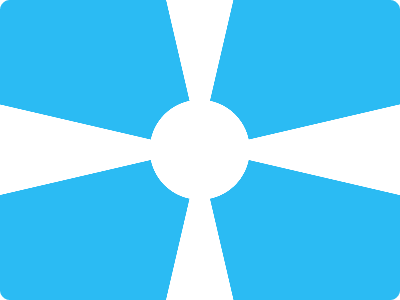

# CSS Battle Daily Targets: 1/3/2024

### Daily Targets to Solve
  
[see the daily target](https://cssbattle.dev/play/zgmRBxSPDFV9HOQJYazS)

### Description

In this challenge, the objective is to create a visually captivating set of quadrant shapes using HTML and CSS. Each quadrant (q1, q2, q3, q4) is composed of three distinct elements - a circular shape (cir) and two triangular shapes (tri1 and tri2). The entire composition is set against a stylish blue background (#2bbbf3).

### Stats
**Match**: 99.8%  
**Score**: 593.72{1238}

### Code

```html
<div class="qua q1">
  <div class="cir"></div>
  <div class="tri1"></div>
  <div class="tri2"></div>
</div>
<div class="qua q2">
  <div class="cir"></div>
  <div class="tri1"></div>
  <div class="tri2"></div>
</div>
<div class="qua q3">
  <div class="cir"></div>
  <div class="tri1"></div>
  <div class="tri2"></div>
</div>
<div class="qua q4">
  <div class="cir"></div>
  <div class="tri1"></div>
  <div class="tri2"></div>
</div>
<style>
  *,
  *::before,
  *::after {
    margin: 0;
    padding: 0;
    border: 0;
  }
  body {
    margin: 0;
    display: flex;
    flex-wrap: wrap;
  }
  .qua {
    width: 50%;
    height: 50%;
    background: #2bbbf3;
    position: relative;
  }
  .qua div {
    position: absolute;
    background: #fff;
  }

  .cir {
    height: 50px;
    width: 50px;
    bottom: 0;
    right: 0;
    border-top-left-radius: 100%;
    z-index: 2;
  }
  .tri1 {
    height: 0;
    width: 5px;
    top: 0;
    right: 0;
    border-left: 30px solid #2bbbf3;
    border-top: 150px solid transparent;
  }

  .tri2 {
    width: 0;
    height: 0;
    bottom: 0;
    border-top: 45px solid #2bbbf3;
    border-left: 200px solid transparent;
  }
  .q2 {
    transform: scaleX(-1);
  }
  .q3 {
    transform: scaleY(-1);
  }
  .q4 {
    transform: scale(-1);
  }
</style>
```
