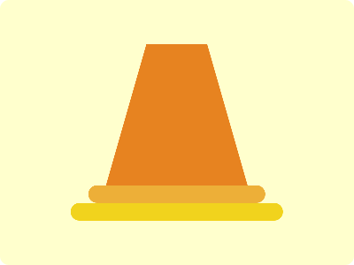

# CSS Battle Daily Targets: 15/3/2024

### Daily Targets to Solve

  
[see the daily target](https://cssbattle.dev/play/IBVI7qzZY5XqxcJGKU0q)

### Stats

**Match**: 99.9%  
**Score**: 597.53{332}

### Code

```html
<p><p a><div>
<style>
  body{
    background:#FFFFCD;
    display:grid;
    place-items:center;
  }
  div,p{
    position:absolute;
  }
  div {
    width:160;
    height:160;
    background:#E78320;
    translate:0 -20px;
    clip-path:polygon(28% 0,72% 0,100% 100%, 0% 100%)
  }
  p{
    background:#EDAF38;
    height:20;
    width:200;
    translate:0 70px;
    border-radius:20px;
  }
  [a]{
    background:#F1D31D;
    translate:0 90px;
    width:240;
  }
</style>
```

### Code Explanation

- **Background (`body`):** The `body` background color is set to a light yellow shade (`#FFFFCD`), providing a bright and vibrant backdrop for the shapes.

- **Shapes (`div`, `p`, `[a]`):** Three elements contribute to the design. The `div` element represents a trapezoidal shape with a dark orange background (`#E78320`). It is positioned at the top center of the background using absolute positioning and translated upwards by 20 pixels. The `p` element forms a horizontal bar with a light orange background (`#EDAF38`). It is positioned below the trapezoidal shape and translated downwards by 70 pixels. The `[a]` attribute selector modifies another horizontal bar with a slightly lighter orange background (`#F1D31D`). It is positioned further below and translated downwards by 90 pixels.

- **Positioning (`position`, `absolute`, `translate`):** All elements (`div`, `p`, `[a]`) are absolutely positioned to allow precise control over their placement. The `translate` property is used to adjust the vertical position of the elements.

- **Clipping (`clip-path`):** The `clip-path` property is applied to the `div` element to define its shape. It uses a polygon shape to create a trapezoidal clipping path, revealing only a portion of the element.

The overall result is a visually dynamic composition with a trapezoidal shape and two horizontal bars against a light yellow background, achieving a near-perfect match and a high score.