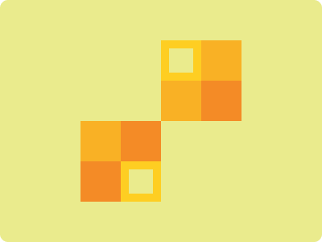

# CSS Battle Daily Targets: 15/3/2024

### Daily Targets to Solve

  
[see the daily target](https://cssbattle.dev/play/JX0EAoyHvalIVLo22TlX)

### Stats

**Match**: 99.6%  
**Score**: 591.63{281}

### Code

```html
<div><div a>
<style>
  body{
    background:#EAEB8D;
  }
  div {
    position:absolute;
    top:50;
    left:50%;
    width:30;
    height:31;
    border:10px solid#FECE22;
    color:#F9B125;
    box-shadow:50px 0,50px 50px#F48B26,0 50px
  }
  [a]{
    top:140;
    left:-60;
    width:31;
    rotate:180deg;
    color:#F48B26;
    box-shadow:50px 0,50px 50px#F9B125,0 50px
  }
</style>
```

### Code Explanation

- **Background (`body`):** The `body` background color is set to a light yellow shade (`#EAEB8D`), providing a bright and vibrant backdrop for the shapes.

- **Shapes (`div`, `[a]`):** Two elements contribute to the design. The `div` element represents a trapezoidal shape with a dark orange background (`#FECE22`). It is positioned at the top center of the background using absolute positioning. The `[a]` attribute selector modifies another trapezoidal shape with a slightly lighter orange background (`#F48B26`). It is positioned below the first trapezoidal shape.

- **Positioning (`position`, `absolute`):** Both elements (`div` and `[a]`) are absolutely positioned to allow precise control over their placement.

- **Border Styling (`border`):** The `border` property is applied to the `div` element to create the trapezoidal shape with borders.

- **Rotation (`rotate`):** The `[a]` attribute selector applies a rotation effect to the second trapezoidal shape, rotating it by 180 degrees.

- **Shadow Effects (`box-shadow`):** The `box-shadow` property is used to add shadow effects to both shapes, enhancing their visual appeal.

The overall result is a visually dynamic composition with two trapezoidal shapes against a light yellow background, achieving a near-perfect match and a high score.