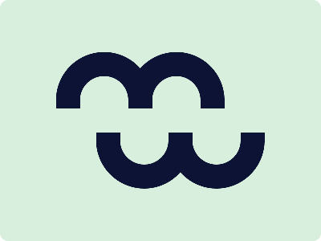

# CSS Battle Daily Targets: 2/3/2024

### Daily Targets to Solve
  
[see the daily target](https://cssbattle.dev/play/vH2qVEvja02TZ7iSu6Sq)

### Description

In this challenge, the task is to create an intriguing composition of quadrant shapes using HTML and CSS. The design features arcs and rectangles arranged in a circular pattern. Here's a breakdown of the provided code:

### Stats
Match: 99.2%  
Score: 581.95{1118}

### Code

```html
<div class="arc">
  <div></div>
</div>
<div class="arc a2">
  <div></div>
</div>
<div class="sec">
  <div class="arc">
    <div></div>
  </div>
  <div class="arc a2">
    <div></div>
  </div>
</div>
<style>
  body {
    background: #d8efdd;
  }
  div {
    position: absolute;
  }
  .arc {
    top: 65px;
    left: 70px;
    width: 120px;
    height: 70px;
    background: #0d1335;
    border-radius: 100px 100px 0 0;
  }
  .arc div {
    top: 30px;
    left: 30px;
    width: 60px;
    height: 40px;
    background: #d8efdd;
    border-radius: 100px 100px 0 0;
  }
  .a2 {
    left: 160px;
  }
  .sec {
    position: relative;
    top: 290px;
    left: 40px;
    transform: scaleY(-1);
  }
</style>
```
