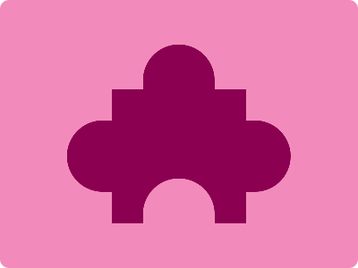

# CSS Battle Daily Targets: 7/3/2024

### Daily Targets to Solve
  
[see the daily target](https://cssbattle.dev/play/lJTvt2AW1n9KLimvcciV)

### Description

In this challenge, the goal is to craft an impactful composition of shapes using HTML and CSS. The design features a combination of squares and circular shapes forming an intricate and visually dynamic pattern against a vibrant pink background (#F28BBB).

### Stats
**Match**: 100%  
**Score**: 601.02{627}

### Code

```html
<div class='sq'></div>
<div class="ci1"></div>
<div class="ci2"></div>
<div class="ci3"></div>
<div class="ci4"></div>
<style>
  body{
    background:#F28BBB;
    margin:0;
  }
  div {
    position: absolute;
    background: #8B0051;
  }
  .sq{
    top:100px;
    left: 125px;
    width: 150px;
    height:150px;
  }
  .ci1, .ci2, .ci3, .ci4{
    width: 80px;
    height: 50px;
    top: 50px;
    left: 160px;
    border-radius: 100px 100px 0 0;
  }
  .ci2{
    background:#F28BBB;
    top:200px;
  }
  .ci3, .ci4{
    top: 150px;
    left: 260px;
    rotate: 90deg;
  }
  .ci4{
    left: 60px;
    rotate: -90deg;
  }
</style>
```
