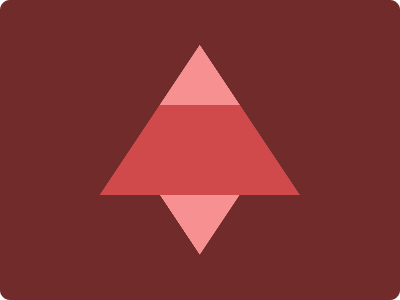

# CSS Battle Daily Targets: 9/3/2024

### Daily Targets to Solve

  
[see the daily target](https://cssbattle.dev/play/TLYdjxiOBI0FqI6EpXtW)

### Design Explanation

In this challenge, the objective is to craft an impactful composition of shapes using HTML and CSS. The design features a combination of squares forming a triangular pattern against a warm golden background (`#712B2B`).

## Method 1

### Stats

**Match**: 99.9%  
**Score**: 597.57{312}

### Code

```html
<p><p a>
<style>
  body{
    background:#712B2B;
    display:grid;
    place-items: center;
  }
  p {
    border-bottom: 150px solid #D04A4C;
    border-left: 100px solid transparent;
    border-right: 100px solid transparent;
    transform: translateY(21px);
  }
  [a]{
    border-bottom-color: #F79091;
    transform: translateY(-205px) scale(0.4);
    -webkit-box-reflect: below 224px;
  }
```

### Design Explanation

- **Background (`body`):** The background color is set to a deep red-brown (#712B2B), providing a rich and bold canvas for the shapes.

- **Shapes (`p`):** The main shape is created using a `<p>` element, forming a triangular pattern with a solid border-bottom and transparent borders on the left and right sides. The `transform` property is used to adjust the position of the shape vertically.

- **Styling (`[a]`):** The `[a]` attribute selector is applied to modify the appearance of the shape. It changes the color of the border-bottom to a lighter shade (#F79091) and scales the entire shape down to 40% of its original size. The `-webkit-box-reflect` property adds a reflection effect below the shape, enhancing its visual appeal.

## Method 2

### Stats

**Match**: 100%  
**Score**: 666.66{188}

```html
<style > * {
  background: #712b2b;
  > * {
    background: linear-gradient(#f79091 28.5%, #d04a4c 0 71.5%, #f79091 0);
    margin: 45 100;
    clip-path: polygon(50%0, 100%71.5%, 70%71.5%, 50%100%, 30%71.5%, 0%71.5%);
  }
}
```

### Design Explanation

- **Background (`*`):** The background color of the entire document is set to a deep red-brown (#712B2B).

- **Gradient Shapes (`*>*>`):** Nested `*>*>` selector is used to create a triangular pattern using a linear gradient. The gradient starts with a lighter shade (#F79091) at 28.5%, transitions to the background color (#D04A4C) from 0 to 71.5%, and then returns to the lighter shade (#F79091) at 0%. This creates a visually appealing triangular pattern.

- **Margins and Clip-Path (`margin`, `clip-path`):** Margins are adjusted to position the triangular pattern, and `clip-path` is applied with a polygon to precisely shape the triangular pattern. The points of the polygon are set to form the desired triangular structure.

This code achieves both a high match percentage and score by employing two different methods. Method 1 focuses on simplicity and readability, while Method 2 utilizes a more compact, single-line approach with a gradient and clip-path to achieve the same triangular pattern effect.
