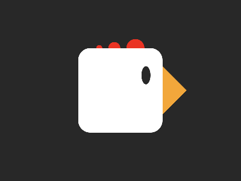

# CSS Battle Daily Targets: 27/03/2025

### Daily Targets to Solve

  
[see the daily target](https://cssbattle.dev/play/o6LXD89QZyqyC0KRrJUl)  
Check out the solution video on [YouTube](https://youtube.com/shorts/GxjVAUEiCI8)

### Stats

**Match**: 99.9%  
**Score**: 597.48 {361}

### Code

```html
<p><a><b><c>
<style>
*{
  background:#282828;
    position:fixed
}
  p{
    padding:5px;
    background:#EA3323;
    border-radius:50%;
    margin:67 152;
    color:EA3323;
    box-shadow:25px 0 0 5px,60px 0 0 10px
  }

  a{
    padding:70;
    background:#FFF;
    margin:0-35;
    border-radius:20px
  }
    b{
    padding:15+8;
    margin:-40 34;
    border-radius:50%
  }
  c{
    padding:40;
    clip-path: polygon(0 0, 0% 100%, 50% 50%);
    background:#F2A73B;
    margin:-15 28
  }
</style>
```

### **Code Explanation**

This CSS code is structured to replicate a CSS Battle challenge using minimal HTML and efficient styling techniques.

#### **Background (`*` selector)**  
- `background:#282828;` sets a dark gray background for the entire page.  
- `position:fixed;` ensures all elements remain in place relative to the viewport.  

#### **Red Circular Shape (`p` element)**  
- `background:#EA3323;` sets a bright red color.  
- `border-radius:50%;` ensures the shape is a perfect circle.  
- `margin:67 152;` positions it within the canvas.  
- `box-shadow:25px 0 0 5px, 60px 0 0 10px;` adds multiple layers of shadows to enhance the design.  

#### **White Shape (`a` element)**  
- `background:#FFF;` sets a white color.  
- `border-radius:20px;` rounds the edges slightly.  
- `margin:0 -35;` positions it in relation to other elements.  

#### **Small Circular Shape (`b` element)**  
- `border-radius:50%;` makes it a perfect circle.  
- `padding:15+8;` (invalid syntax, as CSS does not support direct arithmetic).  
- `margin:-40 34;` positions it accordingly.  

#### **Triangular Shape (`c` element)**  
- `clip-path: polygon(0 0, 0% 100%, 50% 50%);` creates a custom triangular shape.  
- `background:#F2A73B;` gives it a warm orange color.  
- `margin:-15 28;` fine-tunes its position.  
