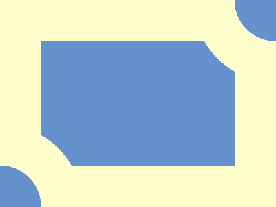

# CSS Battle Daily Targets: 29/03/2025

### Daily Targets to Solve

  
[Go To Daily Target](https://cssbattle.dev/play/uUJE8UIv4pcAQOiQVEJL)  
Check out the solution video on [YouTube](https://youtube.com/shorts/08IQXMQyWik)

### Stats

**Match**: 100%  
**Score**: 679.14 {170}

---

### Code

```html
<p><a>
<style>
*{
  background:#FFFFCD;
  *{
    background:#6592CF;
    margin:60;
  }
}
  p,a{
    position:fixed;
    padding:60;
    border-radius:50%;
    margin:-180 220;
    border:60px solid#FFFFCD
  }
  a{
    margin:180-520
  }
</style>
```

### **Code Explanation**

This CSS code attempts to recreate a CSS Battle challenge using minimal HTML and efficient styling.

#### **Background (`*` selector)**
- `background:#FFFFCD;` sets the page background to a light yellow color.
- Inside the nested `*{}` block:
  - `background:#6592CF;` sets all elements' background to a blue shade.
  - `margin:60;` applies a margin, but since it's not explicitly defined (`margin: 60px;`), it might not work as expected.

#### **Main Circular Shapes (`p` and `a` elements)**
- `position:fixed;` keeps them fixed in place.
- `padding:60;` defines their size (though missing a unit, which may cause issues).
- `border-radius:50%;` makes them perfect circles.
- `margin:-180 220;` attempts to position the first circle.
- `border:60px solid #FFFFCD;` adds a thick yellow border around both circles.

#### **Second Circle (`a` element)**
- `margin:180-520;` has invalid syntax (CSS does not support arithmetic operations like this).