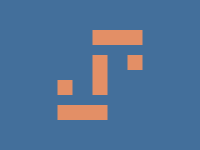

# CSS Battle Daily Targets: 31/03/2025

### Daily Targets to Solve

  
[Go To Daily Target](https://cssbattle.dev/play/nkcT6TW01L46qKmGOZ8r)  
Check out the solution video on [YouTube](https://youtube.com/shorts/NGtI-A_ar9Q)

### Stats

**Match**: 100%  
**Score**: 648.21 {222}

---

### Code

```html
<p><a><b>
<style>
*{
  background:#436F9B
}
  p,a,b{
    position:fixed;
    padding:40+15;
    background:#E38F66;
    margin:102 177;
    color:E38F66;
  }
  a,b{
    padding:15+50;
    margin:60-85;
    box-shadow:70px -150px
  }
  b{
    padding:15;
    margin:-65-50;
    box-shadow:140px -50px
  }
</style>
```

### **Code Explanation**

This CSS code attempts to replicate the given CSS Battle challenge using minimal HTML and efficient styling techniques.

#### **Background (`*` selector)**
- `background:#436F9B;` sets the background color of the page to a blue shade.

#### **Main Shape (Created Using `<p>`, `<a>`, and `<b>` Elements)**
- `p, a, b {}`: These elements are used to construct the visual design.
- `position: fixed;` keeps the shapes in a fixed position relative to the viewport.
- `background: #E38F66;` applies an orange-brown color to the elements.

#### **Padding & Positioning**
- `padding: 40+15;` (Invalid CSS: Direct arithmetic like `40+15` isn’t valid).
- `margin: 102 177;` (Likely incorrect syntax, should be `margin: 102px 177px;`).
- `color: E38F66;` (Missing `#` before the color hex code).

#### **Shadow Effects**
- `box-shadow: 70px -150px;` on `a, b` adds shadows to simulate part of the shape.
- `box-shadow: 140px -50px;` on `b` further enhances the design.