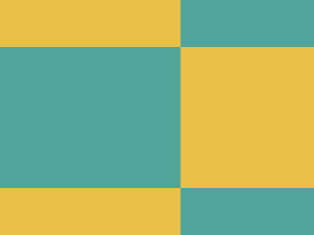

# CSS Battle Daily Targets: 01/04/2025

### Daily Targets to Solve

  
[Go To Daily Target](https://cssbattle.dev/play/XvTml39fx0hCsxmeIrGk)  
Check out the solution video on [YouTube](https://youtube.com/shorts/jqYVfh3iEb4)

### Stats

**Match**: 100%  
**Score**: 733.67 {115}

---

### Code

```html
<p>
<style>
*{
  background:#EAC049;
  *{
    background:#51A499;
    margin:60 170 60 0;
    color:51A499;
    box-shadow:243q -190q,243q 190q
  }
}
</style>
```

### **Code Explanation**

This CSS code attempts to replicate the given CSS Battle challenge using minimal HTML and efficient styling techniques.

#### **Background (`*` selector)**
- `background:#EAC049;` sets the background color of the page to a golden yellow shade.

#### **Main Shape (`p` element)**
- The `p` element is used to construct the shape.
- Inside the nested `*{}` selector:
  - `background:#51A499;` changes the shape's background to a teal shade.
  - `margin: 60 170 60 0;` positions it within the canvas.
  - `color: 51A499;` is incorrect syntax (missing `#` before the hex code).
  - `box-shadow: 230px -180px, 230px 180px;` creates duplicate shapes positioned at an offset.
