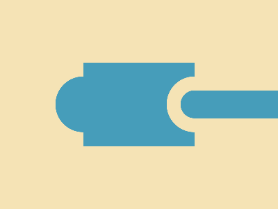

# CSS Battle Daily Targets: 03/04/2025

### Daily Targets to Solve

  
[Go To Daily Target](https://cssbattle.dev/play/bhYmbRSWTKErNUPeKDrb)  
Check out the solution video on [YouTube](https://youtube.com/shorts/EZQnB7tEYk8)

### Stats

**Match**: 100%  
**Score**: 671.94 {180}

---

### Code

```html
<p>
<style>
*{
  background:#F5E3B5;
  *{
    background:#469DBA;
    margin:90 120
  }
}
  p{
    position:fixed;
    padding:20+90;
    border:22q solid#F5E3B5;
    border-radius:100q;
    margin:20 120;
    box-shadow:-160px 0#469DBA
  }
</style>

```

### **Code Explanation**

This CSS code attempts to recreate the given CSS Battle challenge using minimal HTML and efficient styling.

#### **Background (`*` selector)**
- `background:#F5E3B5;` sets the page background to a **light beige color**.

#### **Nested `*` Selector**
- Inside `*{}`:  
  - `background:#469DBA;` changes the background color of all elements to a **blue shade**.
  - `margin:90 120;` sets the margin, but it's **missing units (`px`)** and should be corrected to `margin: 90px 120px;`.

#### **Main Shape (`p` element)**
- `position:fixed;` ensures the shape stays in a fixed position on the viewport.
- `padding:20+90;` is **invalid CSS** because direct arithmetic like `20+90` isn't supported.
- `border:22q solid #F5E3B5;`  
  - `22q` is **invalid**, as `q` isn't a valid CSS unit. It should likely be `22px`.
- `border-radius:100q;`  
  - **Invalid unit (`q`)** again; should be `border-radius: 100%;` for a circular shape.
- `margin:20 120;`  
  - Missing **units (`px`)**, should be `margin: 20px 120px;`.
- `box-shadow:-160px 0 #469DBA;`  
  - Creates a **duplicate shape offset to the left**.
