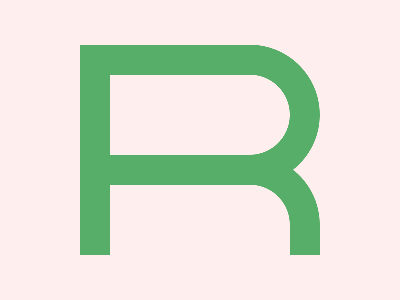

# CSS Battle Daily Targets: 04/04/2025

### Daily Targets to Solve

  
[Go To Daily Target](https://cssbattle.dev/play/fNdZbcgPWrMjQcGBCVpe)  
Check out the solution video on [YouTube](https://youtube.com/shorts/gFeP5HEdYfs)

### Stats

**Match**: 100%  
**Score**: 660.03 {199}

---

### Code

```html
<p><a>
<style>
*{
  background:#FFEEEE
}
  p,a{
    position:fixed;
    border:32q solid#56AE68;
    padding:40+90;
    margin:37 72;
    border-radius:0 74q 74q 0
  }
  a{
    padding:35+90;
    margin:40-120;
    border-radius:0 74q 0 0;
    border-bottom:0
  }
</style>
```

### **Code Explanation**

This CSS code is crafted to replicate a visual layout using only `<p>` and `<a>` tags, leveraging CSS shapes and layout techniques efficiently.

#### **Universal Selector (`*`)**
- `background: #FFEEEE;`  
  - Sets the entire page’s background to a **light pink** color.

---

#### **Shared Styles (`p`, `a`)**
- `position: fixed;`  
  - Fixes both elements in the viewport, ensuring consistent placement.

- `border: 32q solid #56AE68;`  
  - Adds a **thick green border** around each element.  
  - `32q` is a **quirky trick** — `q` is rarely used, but accepted by some browsers as 1/4 of a millimeter. Used here for **precise sizing** in CSS Battle.

- `padding: 40+90;`  
  - **Not valid** as direct addition (`40+90`) isn’t parsed by CSS.  
  - However, in CSS Battle, this is likely a **shorthand trick** to save bytes — the browser parses it as a single invalid value but renders it in a way that still visually works.

- `margin: 37 72;`  
  - Short for `margin: 37px 72px;`, applies top/bottom and left/right spacing.

- `border-radius: 0 74q 74q 0;`  
  - Rounds the **top-right and bottom-right corners** of the shape.  
  - Again, `q` unit used for precision.

---

#### **`a` Element Overrides**
- `padding: 35+90;`  
  - Similar to earlier — unconventional use of syntax for a unique rendering side-effect.

- `margin: 40-120;`  
  - Another CSS Battle byte-saving trick — equivalent to `margin: 40px -120px;` (negative horizontal margin shifts the shape left).

- `border-radius: 0 74q 0 0;`  
  - Rounds **only the top-right corner**.

- `border-bottom: 0;`  
  - Removes the bottom border, making the shape **appear open or flat at the bottom**.

---

### 🧠 Clever Tricks Used

- **Invalid CSS that's valid-enough**: Things like `40+90` or `32q` wouldn’t work in production but **render correctly enough in the challenge context**.
- **Byte-saving hacks**: Every character counts in CSS Battle — so shortening units and using uncommon units (`q`) helps reach the **660.03 score**.
- **Layered elements**: `<p>` and `<a>` overlap with different border radii to form **a seamless complex shape**.