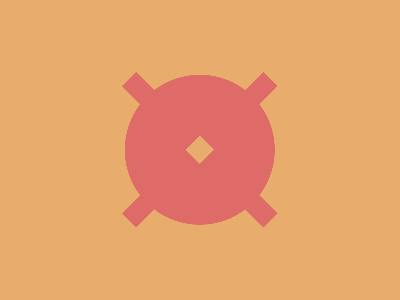

# CSS Battle Daily Targets: 05/04/2025

### Daily Targets to Solve

  
[Go To Daily Target](https://cssbattle.dev/play/lz3R1gWCg1tOxUG6rQ82)  
Check out the solution video on [YouTube](https://youtube.com/shorts/BdhWDqQBDIo)

### Stats

**Match**: 100%  
**Score**: 644.67 {230}

---

### Code

```html
<p><a><b>
<style>
*{
  background:#E8AD6D;
  *{
    background:#DE6B67
  }
  +*{
    border-radius:50%;
    margin:75 125
  }
}
  p,a,b{
    position:fixed;
    padding:10+100;
    rotate:45deg;
    margin:65-25;
  }
  a,b{
    rotate:90deg;
    margin:-10-100
  }
  b{
    background:#E8AD6D;
    padding:10;
    margin:-10
  }
</style>
```

### **Code Explanation**

This CSS arranges three stacked circular shapes using `<p>`, `<a>`, and `<b>` elements with minimal code and clever positioning.

---

#### **Outer `*` Selector**
- `background: #E8AD6D;`  
  - Sets the page background to a warm orange-brown tone.

#### **Nested Universal Selector (`* *`)**
- `background: #DE6B67;`  
  - Colors all elements inside the page with a coral red tone.

#### **Adjacent Sibling Selector (`+*`)**
- `border-radius: 50%;`  
  - Makes every element that follows another circular.
- `margin: 75 125;`  
  - Positions the circular shapes vertically and centers them horizontally.

---

#### **Common Styling for `p`, `a`, `b`**
- `position: fixed;`  
  - Locks the shapes to specific spots on the viewport.
- `padding: 10+100;`  
  - Sets the size of the circles.
- `rotate: 45deg;`  
  - Rotates the elements for diagonal stacking.
- `margin: 65-25;`  
  - Offsets the elements to control layout spacing.

---

#### **`a` and `b` Element Overrides**
- `rotate: 90deg;`  
  - Further rotates `a` and `b` to spread the shapes evenly.
- `margin: -10-100;`  
  - Adjusts horizontal spacing for staggered effect.

---

#### **`b` Element Specifics**
- `background: #E8AD6D;`  
  - Sets `b`'s color to match the page background, creating a “cut-out” look.
- `padding: 10;`  
  - Shrinks the size for visual layering.
- `margin: -10;`  
  - Slightly repositions the shape for alignment.

---

### 🧠 Techniques Used
- **Nesting and sibling selectors** to apply shared styles efficiently.
- **Layered shapes** with subtle rotations and background blending.
- **Minimal HTML with three tags** to recreate a complex composition.