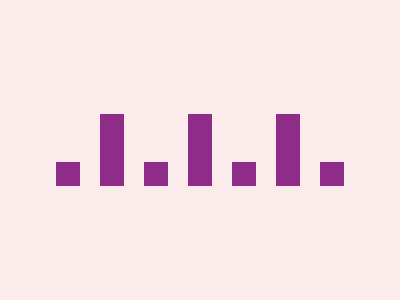

# CSS Battle Daily Targets: 07/04/2025

### Daily Targets to Solve

  
[Go To Daily Target](https://cssbattle.dev/play/Bgmy61ozMHMMmQrOu6Aq)  
Check out the solution video on [YouTube](https://youtube.com/shorts/hKq1JRbOCvg)

### Stats

**Match**: 100%  
**Score**: 659.46 {200}

---

### Code
```html
<p><a>
<style>
*{
  background:#FCEBEB
}
  p,a{
    position:fixed;
    background:#8E2C88;
    padding:12;
    color:#8E2C88;
    margin:154 48;
    box-shadow:88px 0,176px 0,264px 0
  }
  a{
    padding:36+12;
    margin:-60 32;
    box-shadow:88px 0,176px 0
  }
</style>
```

### **Code Explanation**

This CSS draws **two rows of purple shapes** — **squares on top** and **rectangles below** — using just two HTML elements (`<p>` and `<a>`) and clever use of `box-shadow` to duplicate them horizontally.

---

#### **Global Styles (`*`)**
- `background: #FCEBEB;`  
  - Sets the entire canvas to a **soft pinkish-peach background**, matching the challenge's background color.

---

#### **Top Row – `<p>` (Squares)**
- `position: fixed;`  
  - Fixes the shape in the viewport so it doesn't move with scroll.
- `background: #8E2C88;`  
  - Deep **purple fill** for the shape.
- `padding: 12;`  
  - Creates a **square** of `24x24px` (12px on all sides).
- `margin: 154 48;`  
  - Moves the first square to a **specific location** near the top.
- `box-shadow: 88px 0, 176px 0, 264px 0;`  
  - Clones the square three times to the right, forming **4 evenly spaced purple squares** in a row.

---

#### **Bottom Row – `<a>` (Rectangles)**
- Inherits from `<p>`, but overrides:
  - `padding: 36+12;`  
    - Produces a **vertical rectangle** (`48px` height × `24px` width).
  - `margin: -60 32;`  
    - Shifts the element **downward** and slightly **left**, placing it below the top row.
  - `box-shadow: 88px 0, 176px 0;`  
    - Adds two rectangles to the right, forming **three vertical rectangles** in a row.

---

### 🧠 Techniques Used
- **Box-shadow cloning**: Great trick to reduce HTML tags while drawing repeated shapes.
- **Element reuse**: Using `<p>` and `<a>` strategically to draw two different rows.
- **Shape control via padding**: Padding values control both the **dimensions** and **aspect ratio** (square vs rectangle).
- **Minimalist HTML with creative CSS tricks**: Essential in CSS Battle for top scores.
