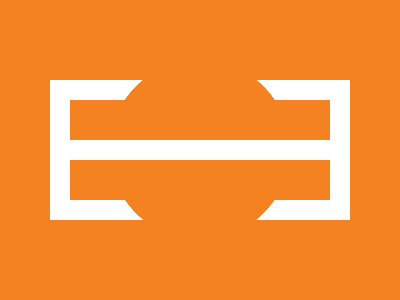

# CSS Battle Daily Targets: 09/04/2025

### Daily Targets to Solve

  
[Go To Daily Target](https://cssbattle.dev/play/B9oigbDhlqcRMq3rKk3Q)  
Check out the solution video on [YouTube](https://youtube.com/shorts/bYelalIAIYI)

### Stats

**Match**: 100%  
**Score**: 670.59 {182}

---

### Code
```html
<p><a>
<style>
*{
  background:#F58220;
  +*{
    border:22q solid#FFF;
    margin:80 50
  }
}
  p,a{
    position:fixed
  }
  p{
    padding:90;
    border-radius:50%;
    margin:-40 40
  }
  a{
    background:#FFF;
    padding:10+130;
    margin:-10-130
  }
</style>
```

---

### **Code Explanation**

This CSS recreates the target using just two HTML elements (`<p>` and `<a>`) by layering a **large white vertical bar** on top of an **orange circular shape**, with a **white circular border** surrounding everything. Clever stacking and sizing tricks give a polished, minimal result.

---

#### **Global Styles (`*`)**
- `background: #F58220;`  
  - Sets the canvas to a **bright orange**, matching the background color of the target.
  
- `+*` (Adjacent sibling selector):  
  - Targets both `<p>` and `<a>` since both follow the root element.
  - `border: 22q solid #FFF;`  
    - Applies a **white border** (uses the `q` unit for bytesaving).
  - `margin: 80 50;`  
    - Centers the content horizontally and vertically with some buffer.

---

#### **Circular Shape – `<p>`**
- `position: fixed;`  
  - Keeps the circle fixed on the screen.
- `padding: 90;`  
  - Creates a **180x180px circle**.
- `border-radius: 50%;`  
  - Makes it a perfect **circle**.
- `margin: -40 40;`  
  - Offsets the position slightly upward and to the right.

---

#### **Vertical Bar – `<a>`**
- `position: fixed;`  
  - Keeps the bar locked on screen.
- `background: #FFF;`  
  - Fills it with **white**, matching the bar color.
- `padding: 10+130;`  
  - Creates a **tall vertical rectangle** (`20px` width × `260px` height).
- `margin: -10 -130;`  
  - Centers the bar inside the circle by nudging it up and left.

---

### 🧠 Techniques Used
- **Sibling selector trick (`+*`)** to style multiple elements without extra selectors.
- **`q` unit** used to reduce character count (compression trick).
- **Precise layering and margin tweaks** for perfect alignment.
- **Element reuse** with minimal tags (2 elements) — ideal for CSS Battle scoring.
