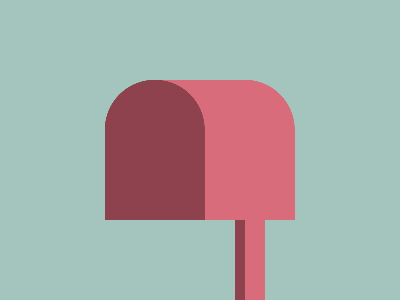

# CSS Battle Daily Targets: 11/04/2025

### Daily Targets to Solve

  
[Go To Daily Target](https://cssbattle.dev/play/TepLBs6NaCqKPin7WJiy)  
Check out the solution video on [YouTube](https://youtube.com/shorts/7u4CRwykn_c)

### Stats

**Match**: 100%  
**Score**: 639.84 {242}

---

### Code

```html
<p><a>
<style>
*{
  background:#A4C5BD;
  *{
    background:#D96C7B;
  }
  +*{
    margin:80 105;
    border-radius:54q 54q 0 0
  }
}
  p,a{
    position:fixed;
  }
p{
  background:#8D424D;
  padding:70+50;
  margin:0;
  border-radius:54q 54q 0 0
}
  a{
    padding:40+10;
    margin:70 90;
    box-shadow:-11q 0#8D424D
  }
</style>
```

---

### **Code Explanation**

This CSS draws **a pair of rounded pink-red arches** sitting on top of a **blue-green background**, using only two HTML tags (`<p>` and `<a>`) — one for the full arch, and the other duplicated with a shadow to add the left arch.

---

#### **Global Styles (`*`)**

- `background: #A4C5BD;`  
  - Sets the canvas background to a **muted greenish-cyan** tone.
- Nested `*` inside `*`:
  - Applies `background: #D96C7B;` — fills `<p>` and `<a>` with **light pink** (overridden later for `<p>`).
- `+*` (Adjacent sibling selector):  
  - Targets both `<p>` and `<a>`.
  - `margin: 80 105;` — positions the arch in the center.
  - `border-radius: 54q 54q 0 0;` — gives a **rounded top** to simulate arches.

---

#### **Right Arch – `<p>`**

- `background: #8D424D;` — deep **maroonish red**, overriding global pink.
- `padding: 70+50;` — makes a **tall rectangle** with rounded top (140×100).
- `margin: 0;` — stays in default position.
- `border-radius: 54q 54q 0 0;` — gives the signature **arch top**.

---

#### **Left Arch – `<a>`**

- `padding: 40+10;` — creates a **shorter vertical rectangle**.
- `margin: 70 90;` — moves it slightly down and right.
- `box-shadow: -11q 0 #8D424D;` — duplicates the element to the **left**, forming the second (left) arch.

---

### 🧠 Techniques Used

- **Nested universal selectors**: Compact styling for multiple elements inside `*`.
- **Box-shadow cloning**: Efficient reuse of one element to mirror a shape.
- **Rounded top via border-radius**: Classic way to simulate arches.
- **Padding-based sizing**: Element shapes defined by padding alone.
