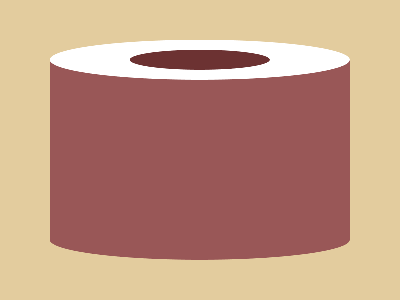

# CSS Battle Daily Targets: 12/04/2025

### Daily Targets to Solve

  
[Go To Daily Target](https://cssbattle.dev/play/vlaMjXUreTJvLIrZ1Vk1)  
Check out the solution video on [YouTube](https://youtube.com/shorts/Ie3wq3rsXDQ)

### Stats

**Match**: 100%  
**Score**: 646.41 {226}

---

### Code

```html
<p><a>
<style>
*{
  background:#E3CC9E;
  *{
    background:#995757;
    margin:60 50
  }
}
p,a{
  position:fixed;
  background:#FFFFFF;
  padding:20+150;
  border-radius:50%;
  margin:-20 0;
  box-shadow:0 191q#995757
}
  a{
    padding:10+70;
    background:#6C3232;
    margin:-10-70;
  }
</style>
```

---

### **Code Explanation**

This battle builds **two white circular shapes** stacked vertically, sitting over a **brown background**, along with a **darker red inner circle** that peeks through at the bottom. All this is achieved using only `<p>` and `<a>` with `box-shadow` tricks and smart margin/padding math.

---

#### **Global Styles (`*`)**

- `background: #E3CC9E;`  
  - Sets the canvas to a **light yellowish-brown** base.
- Nested `*{ background:#995757; margin:60 50; }`:  
  - Applies to children (`<p>`, `<a>`), giving a **light maroon background** and initial positioning.

---

#### **White Circle – `<p>`**

- `position: fixed;` — locks it to the viewport.
- `background: #FFFFFF;` — makes it **white**.
- `padding: 20+150;` — makes it a wide horizontal pill shape (150px horizontal, 20px vertical).
- `border-radius: 50%;` — turns it into a **perfect circle** due to padding ratio.
- `margin: -20 0;` — nudges it up slightly to align visually.
- `box-shadow: 0 191q #995757;` — creates a **duplicate maroon circle** directly below it.

---

#### **Inner Circle – `<a>`**

- `padding: 10+70;` — smaller circle inside the lower one.
- `background: #6C3232;` — a **darker maroon** than the outer one.
- `margin: -10 -70;` — positions it upward and to the left to fit inside the bottom shadow circle of `<p>`.

---

### 🧠 Techniques Used

- **Circle creation via padding + border-radius**.
- **Box-shadow stacking** to duplicate elements vertically.
- **Margin and shadow offsets** to align shapes perfectly.
- **Minimal tag usage** — classic two-element build.
