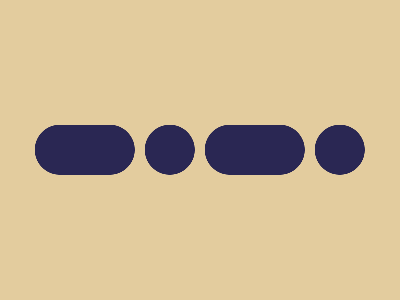

# CSS Battle Daily Targets: 13/04/2025

### Daily Targets to Solve

  
[Go To Daily Target](https://cssbattle.dev/play/fadGsmBXgR2J9cc97SFe)  
Check out the solution video on [YouTube](https://youtube.com/shorts/IqliUFa0k7A)

### Stats

**Match**: 100%  
**Score**: 674.74 {176}

---

### Code

```html
<p><a>
<style>
*{
  background:#E3CC9E
}
  p,a{
    position:fixed;
    padding:25+50;
    background:#2A2753;
    border-radius:55q;
    margin:117 27;
    color:#2A2753;
    box-shadow:180q 0
  }
  a{
    padding:25;
    margin:-25 60
  }
</style>
```

---

### **Code Explanation**

This one builds **four pill-shaped blocks**, two on each side — like **tall rounded buttons** split across the screen. It uses just `<p>` and `<a>` elements to render **symmetric rounded shapes** using `box-shadow` duplication. The color scheme is **dark indigo** on a **warm beige background**.

---

#### **Global Styles (`*`)**

- `background: #E3CC9E;`  
  - Sets the canvas to a **light yellowish-beige** tone.

---

#### **Main Pills – `<p>` and `<a>`**

Both tags share core styling:

- `position: fixed;` — pins them to exact spots on the screen.
- `padding: 25+50;` — gives a tall rounded shape (height: 50px, width: 100px).
- `background: #2A2753;` — deep **indigo** fill color.
- `border-radius: 55q;` — gives a strong **rounded corner**, effectively making them pill-like.
- `margin: 117 27;` — places the elements roughly toward the left-middle vertically.
- `box-shadow: 180q 0;` — duplicates the shape to the **right side**, forming the right pair of pills.

---

#### **Adjustment – `<a>` Element**

- `padding: 25;` — reduces width for a **circular button** feel.
- `margin: -25 60;` — shifts it upwards and to the right, aligning symmetrically opposite to the other shape.

---

### 🧠 Techniques Used

- **Symmetry via box-shadow**: Efficient shape duplication to the right using horizontal offsets.
- **Padding for shape sizing**: Width and height handled using `padding`.
- **Margin offsetting**: Clean and minimal adjustments to position and align both elements.
- **Color inheritance via `color`**: Not used visually here, but can act as a shorthand when reusing styles or shadows.
