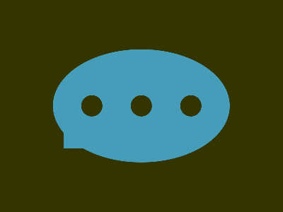

# CSS Battle Daily Targets: 14/04/2025

### Daily Target

  
[Go To Daily Target](https://cssbattle.dev/play/xXDaiGvFSCsm5mnGYLZj)  
Watch the [Solution Video](https://youtube.com/shorts/CNHrtedL39M)

### Stats

**Match**: ✅ 100%  
**Score**: 🟢 648.21 (Rank: 222)

---

### Code

```html
<p><a>
<style>
*{
  background:#343400;
  +*{
    background:#469DBA;
    margin:70 75;
    border-radius:50%
  }
}
  p,a{
    position:fixed;
    padding:16q
  }
  p{
    margin:65 40;
    border-radius:50%;
    color:#343400;
    box-shadow:74q 0,148q 0
  }
  a{
    background:#469DBA;
    margin:30-40
  }
</style>
```

---

### ✅ Code Explanation

This target builds a **set of four cyan circles** (two big on top, two small on bottom) on an **olive-green background**. It uses `<p>` and `<a>` for rendering, with `box-shadow` duplicating shapes.

---

#### 🎨 **Background – `*` Selector**

- `background: #343400;`  
  - Sets the canvas to a **dark olive green**.
- `+*` selector:  
  - Applies to siblings (`<a>` after `<p>`) — sets **cyan blue** (`#469DBA`) background, positions with `margin`, and gives a **circular shape** using `border-radius: 50%`.

---

#### 🟢 **Top Large Circles – `<p>`**

- `padding: 16q;` — creates a **uniformly sized circle**.
- `margin: 65 40;` — positions the base circle to the left.
- `box-shadow: 74q 0, 148q 0`  
  - Duplicates the same circle to the **center** and **right**, forming a total of **three equally spaced large circles**.
- `color: #343400` — not visually used here, possibly a leftover or shadow fallback.

---

#### 🔵 **Bottom Small Circles – `<a>`**

- `background: #469DBA` — cyan blue fill, matches the top circles.
- `padding: 16q;` — keeps size the same (but offset to appear smaller due to layout).
- `margin: 30 -40;` — moves the `<a>` downward and left, visually centering the lower circles.

---

### 🧠 Techniques Used

- **Adjacent Sibling Combinator (`+*`)**: Clever use to style `<a>` without repeating class/tag selectors.
- **Box-shadow duplication**: One of the cleanest tricks to copy shapes across the canvas.
- **Fixed positioning** with `padding` and `margin`: Used to place and size circles.
- **Border-radius: 50%**: Ensures perfect circle shapes.
- **Color layering tricks**: Background and sibling coloring help minimize code while preserving visuals.
