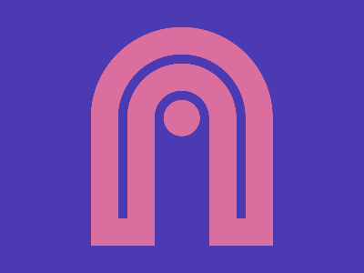

# ✅ CSS Battle Daily Target: 15/04/2025

  
[**Play Target**](https://cssbattle.dev/play/ahUYfqVBpTCVoxZRQnbe)  
[Watch Solution Video](https://youtube.com/shorts/afPdt_9dtck)

### **Your Stats**  
**Match**: ✅ 100%  
**Score**: 🟢 622.49 (chars: 302)

---

## ✅ Code

```html
<p><a>
<style>
*{
  background:#4C3AB3;
  *{
    border:75q solid#D96E9F;
    margin:30 100;
    border-radius:105q 105q 0 0;
    border-bottom:0
  }
}
  p,a{
    position:fixed
  }
  p{
    border:11q solid#4C3AB3;
    padding:85+60;
    border-bottom:0;
    background:transparent;
    margin:-40
  }
  a{
    padding:20;
    border:none;
    background:#D96E9F;
    border-radius:50%;
    margin:-45-20
  }
</style>
```

---

## ✅ Code Explanation

This challenge creates **two pink semi-circular arches** and a **small circle between them** on a **purple background**.

---

### 🎨 **Background – Universal `*` Selector**

- `background: #4C3AB3`  
  - Fills the entire canvas with a **bold purple** base.
- Nested `*` selector:  
  - Targets **descendants** of `body` (i.e., the `p` and `a` tags).
  - Adds a `border: 75q solid #D96E9F` to form **thick curved elements**.
  - `border-radius: 105q 105q 0 0` creates **arched tops**, while `border-bottom: 0` makes them open at the bottom — like **rainbow arches**.
  - `margin: 30 100` pushes them toward the middle horizontally and slightly downward.

---

### 🟣 **Arched Shapes – `<p>`**

- Positioned with `fixed`, with precise sizing using `padding: 85+60`.
- `border: 11q solid #4C3AB3` cuts into the original border slightly to **create the illusion of hollow arches**.
- `margin: -40` shifts it up to align with the top arches properly.
- `background: transparent` ensures only the borders are visible.

---

### 🔴 **Small Circle – `<a>`**

- `padding: 20` makes it a **small circle**.
- `background: #D96E9F` gives it a **matching pink color**.
- `border-radius: 50%` forms the **perfect circle**.
- `margin: -45 -20` positions it centered below the arches.

---

## 🧠 Techniques Used

- **Nested universal selectors**: A CSS trick to bulk-apply styles to all children.
- **Border-only arches**: Using `border-radius` + `border-bottom: 0` to simulate semi-circles.
- **Hollow shape illusion**: Overlaying a thinner border on top of a thicker one.
- **Minimal elements**: Just two tags render the full shape — very efficient!
