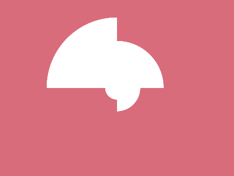

# ✅ CSS Battle Daily Target: 17/04/2025

  
[Play Challenge](https://cssbattle.dev/play/8nL6bpEcztISCcFo0hnL)  
[Watch Solution Video](https://youtube.com/shorts/Yb7Wnk5LubU)

---

## 🔢 Stats

**Match**: ✅ 100%  
**Score**: 🟢 650.56 (Characters: 217)

---

## ✅ Code

```html
<p><a><b><c>
<style>
*{
  background:#D96C7B;
  *{
    position:fixed;
    background:#FFF
  }
}
  
  p,a,b{
    padding:10;
    border-radius:0 0 0 100%;
    margin:142 172
  }
  a,b{
    scale:2;
    margin:0 20;
    rotate:270deg
  }
  c{
    padding:15;
    border-radius:0 0 100%;
    margin:-10 10
  }
</style>
```

---

## ✅ Code Explanation 

This target creates a **clover-like shape** with **three white quarter-circles** and one **semi-circle** on a **rose pink background** (#D96C7B). The layout is achieved using just four HTML elements: `<p>`, `<a>`, `<b>`, and `<c>`, styled efficiently through nested CSS selectors and transformations.

### 🎨 Background

The outer universal selector (`*`) sets the entire page’s background to rose pink. Inside it, a nested universal selector targets all inner elements, giving them a white background and fixed positioning. This allows the shapes to be freely placed on the screen.

### 🍃 Quarter-Circle Leaves

The `<p>`, `<a>`, and `<b>` elements form the three quarter-circles. Each gets a padding of 10 units and a `border-radius` that curves only the bottom-left corner — creating the quarter-circle effect.

- `<p>` sits at the central reference point of the shape.
- `<a>` and `<b>` are scaled to twice their size and rotated 270 degrees to reposition the curved edge, making them point sideways.
- Margins are used to align them horizontally and stack them neatly.

With this, the layout forms a three-leaf clover — two side leaves and one at the top.

### 🌱 Semi-Circle Bottom Leaf

The `<c>` element completes the clover with a semi-circle. It has a slightly larger padding (15 units) and a border-radius curving the bottom half only. It’s nudged upward and centered with a small margin shift. This creates a smooth stem-like finish to the overall shape.

### 🧠 Techniques Used

- **Nested universal selectors** to avoid repeating styles and reduce characters.
- **Border-radius manipulation** for clean quarter and semi-circles.
- **Transformations like scale and rotate** to repurpose a single shape in different orientations.
- **Fixed positioning and minimal HTML** (just four tags) to achieve pixel-perfect alignment.