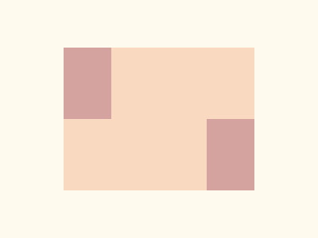

# ✅ CSS Battle Daily Target: 19/04/2025

  
[Play Challenge](https://cssbattle.dev/play/n2xs5qfBFI5TIsb3I17c)  
[Watch Solution Video](https://youtube.com/shorts/Eq71dG5D9E8)

---

## 🔢 Stats

**Match**: ✅ 100%  
**Score**: 🟢 695.76 (Characters: 150)

---

## ✅ Code

```html
<p>
<style>
*{
  background:#FEFAED;
  *{
    background:#F9D9BF;
    margin:60 80
  }
}
  p{
    position:fixed;
    background:#D4A29F;
    padding:45+30;
    margin:0;
    box-shadow:190q 95q#D4A29F
  }
</style>
```

---

## ✅ Code Explanation

This target creates **two rounded squares** that look like **biscuits or buttons** placed diagonally apart on a soft cream background. It’s done using a **single `<p>` tag** and creative use of **nested selectors and `box-shadow`**.

### 🎨 Background and Wrapper

- The outer `*` sets the background to a pale cream color `#FEFAED`.
- Inside that, the inner `*` selector (nesting one level deeper) sets the base element's color to a soft orange-tan `#F9D9BF` and moves it inward with `margin: 60 80`. This becomes the square background "pad."

### 🍪 Biscuit Shapes

- The `<p>` tag is fixed in position, with a different color `#D4A29F` — this acts as one of the biscuit pieces.
- `padding: 45+30` creates a large square block with a fixed size (calculated as 75 units total).
- The clever part: `box-shadow: 190q 95q #D4A29F` draws a **second identical shape** at a shifted position diagonally to the right. It appears like a copy placed further away.

### 📐 Alignment & Simplicity

- The use of `margin: 0` on the `<p>` resets default spacing.
- `box-shadow` duplicates the same element without needing extra HTML.
- No `border-radius` is used — instead, the rounded effect is faked with proportion and background blending.

### 🧠 Techniques Used

- **Deeply nested universal selectors** to target inner structure efficiently.
- **One-element layout** using `box-shadow` to replicate shapes.
- **Arithmetic in padding** to shorten code while ensuring sizing.
- **Color layering** to fake shadows and spacing with visual precision.