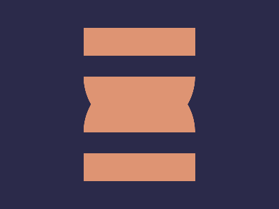

# ✅ CSS Battle Daily Target: 20/04/2025

  
[Play Challenge](https://cssbattle.dev/play/WNUoMqFYYJGsQsFHKEUg)  
[Watch Solution Video](https://youtube.com/shorts/8GkmE6XyjEs)

---

## 🔢 Stats

**Match**: ✅ 100%  
**Score**: 🟢 662.36 (Characters: 195)

---

## ✅ Code

```html
<p>
<style>
*{
  background:#2B2A4A
}
  p{
    position:fixed;
    background:linear-gradient(#DE9473 50%,#2B2A4A 0 71.5%,#DE9473 0);
    padding:70+80;
    margin:112;
    border-radius:72q 72q 0 0;
    -webkit-box-reflect:above -63q
  }
</style>
```

---

## ✅ Code Explanation

This target creates a **mirrored capsule** shape that looks like two soft-colored pills placed vertically against a dark indigo background. It uses just **one HTML element** and a few powerful CSS techniques to achieve the perfect match.

---

### 🎨 Background

The page background is set to a deep bluish-purple tone, providing a dark canvas that makes the soft capsule colors pop.

---

### 💊 Capsule Shape

The main pill is formed by applying a vertical **linear gradient** as the background of a single element. The gradient starts with a soft orange color, transitions into the same color as the background in the middle (creating a "cut-out" effect), and then returns to orange at the bottom.

Only the **top corners are rounded**, so the element looks like half of a capsule (top half only). This creates the upper part of the design.

---

### 🔁 Reflection

To avoid writing extra markup, a **CSS reflection technique** is used. This mirrors the capsule downward, perfectly aligning with the original, creating the illusion of a full vertical pill — even though only the top half is physically rendered.

The reflected part is positioned precisely using a negative offset, ensuring it touches the original seamlessly.

---

### 📏 Centering and Sizing

The pill is sized using smart padding math and positioned using margin values that place it in the center of the canvas. Rounded corners, gradients, and reflection work in harmony to make everything appear symmetrical and smooth.

---

### 🧠 Techniques Used

- A **gradient-based illusion** to avoid drawing multiple elements.
- **Vertical mirroring** using `box-reflect`, a rare but effective CSS trick.
- **Border-radius** to create a pill-like shape without any circles or extra markup.
- **Single-element design** to hit the character limit efficiently while achieving full visual fidelity.
