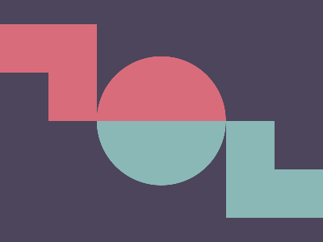

# ✅ CSS Battle Daily Target: 21/04/2025

  
[Play Challenge](https://cssbattle.dev/play/2bjxfcxW3YM3oVfceAZu)  
[Watch Solution Video](https://youtube.com/shorts/3Epg-mudIYA)

---

## 🔢 Stats

**Match**: ✅ 100%  
**Score**: 🟢 643.83 (Characters: 232)

---

## ✅ Code

```html
<p>
<style>
*{
  background:#4C455B;
  +*{
    background:linear-gradient(#D96C7B 50%,#8AB8B6 0);
    margin:70 120;
    border-radius:50%
  }
}
  p,a{
    position:fixed;
    padding:30;
    margin:20-120;
    box-shadow:32q -32q 0 32q#D96C7B,360q 63q#4C455B,328q 95.5q 0 32q#8AB8B6
  }
</style>
```

---

## ✅ Code Explanation

This target presents a set of **two colored spheres** side by side — one pink, one teal — on a dark purple canvas, with a clever illusion of 3D depth using shadows and layering. Despite its apparent complexity, the solution is built using just **a single `<p>` element**, smart CSS nesting, and multiple shadows.

---

### 🌌 Background

The entire canvas is filled with a deep, desaturated purple tone. This acts as a strong neutral backdrop that enhances the soft tones of the two spheres and their highlights.

---

### 🟣 Spheres Creation

Two main spheres are created using:

- A **circular gradient** background applied via a nested universal selector.
- A **border-radius of 50%**, turning the base block into a perfect circle.
- Clever **positioning and margin tricks** to place this circular shape precisely.

The gradient splits the shape horizontally: pink on the top and teal on the bottom — giving the illusion of two hemispheres merged into one.

---

### 💡 Depth and Shadows

This is where the magic happens:

- The **box-shadow** property is used to create **multiple copies** of the circular shape:
  - One is offset slightly up and to the left (a pink sphere).
  - Another is positioned to the right but appears to be cut out or recessed (simulating negative space).
  - The last shadow forms the **teal sphere**, pushed further right and downward.

Together, these shadows simulate depth, distance, and even interaction between the spheres — making it appear as if the pink and teal balls are slightly overlapping or receding.

---

### 🧠 Techniques Used

- **Nested universal selectors** to apply styles without extra tags.
- **Box shadows** to duplicate shapes in different positions without needing extra elements.
- **Gradient split backgrounds** to simulate two-tone effects inside one element.
- **Precise padding and margin arithmetic** to avoid verbose CSS while still nailing alignment.
- **Fixed positioning** to take full control over the layout regardless of browser quirks.
