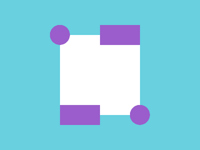

# ✅ CSS Battle Daily Target: 23/04/2025

  
[Play Challenge](https://cssbattle.dev/play/8jh2NqE46ZNyYdSUq0cs)  
[Watch Solution Video](https://youtube.com/shorts/XaXp6wIxZlc)

---

## 🔢 Stats

**Match**: ✅ 100%  
**Score**: 🟢 643.41 (Characters: 233)

---

## ✅ Code

```html
<p><a>
<style>
*{
  background:#68D0DF;
  *{
    background:#FFF;
    margin:70 120
  }
}
  p,a{
    position:fixed;
    background:#9A5DCB;
    padding:20+40;
    margin:-20 80;
    box-shadow:-85q 169q#9A5DCB
  }
  a{
    padding:20;
    border-radius:50%;
    margin:-20-140;
    box-shadow:169q 169q#9A5DCB
  }
</style>
```

---

## ✅ Code Explanation

This target presents a **light cyan canvas** (`#68D0DF`) with a **white square** resting in the center and **three purple shapes** (`#9A5DCB`) that complete the visual — two half-capsules at the bottom corners and one centered circle below.

---

### 🎨 Background and Box

The background is set using the outer universal selector:  
`*{ background: #68D0DF; }`

Inside that, the inner universal selector (`*` nested inside `*`) applies the **main white box**:  
`background: #FFF; margin: 70 120` — which centers it on the canvas horizontally and vertically.

---

### 🔷 Purple Semicapsules

The `<p>` tag and `<a>` tag are used creatively to simulate shapes.

- Both `p` and `a` share common styles using a group selector:  
  `position: fixed; background: #9A5DCB; padding: 20+40; margin: -20 80`  
  This creates a horizontally stretched rectangle with a bit of vertical thickness.

- `p` has a shadow:  
  `box-shadow: -85q 169q #9A5DCB`  
  That renders a **duplicate purple shape on the bottom-left** side — mimicking a capsule or half-disc.

---

### 🟣 Center Circle

The `<a>` tag is then individually styled as a circle:

- `padding: 20; border-radius: 50%`  
- `margin: -20 -140` shifts it to align centrally below the white box.  
- `box-shadow: 169q 169q #9A5DCB` mirrors the technique used in `p`, placing another purple circle directly under the box, centered.

---

### 🧠 Techniques Used

- **Nesting selectors** creatively for minimal markup.
- Using **padding instead of width/height** to control dimensions.
- Strategic use of **box-shadow offsets** to place extra shapes without needing extra elements.
- **Border-radius** on the `<a>` element to form a perfect circle.
- Smart use of **fixed positioning** ensures all shapes stay perfectly placed relative to the viewport.