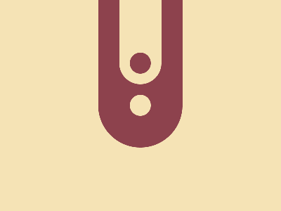

# ✅ CSS Battle Daily Target: 25/04/2025

  
[Play Challenge](https://cssbattle.dev/play/CJNmGjnQKtpmBABqPK3k)  
[Watch Solution Video](https://youtube.com/shorts/8Ko6rQZzLYg)

---

## 🔢 Stats

**Match**: ✅ 100%  
**Score**: 🟢 647.3 (Characters: 224)

---

## ✅ Code

```html
<p><a>
<style>
*{
  background:#F5E3B5
}
  p,a{
    position:fixed;
    padding:80 30;
    border-radius:0 0 50q 50q;
    box-shadow:0 63q 0 32q#8D424D;
    margin:-48 162
  }
  a{
    padding:15;
    background:#8D424D;
    border-radius:50%;
    box-shadow:0 63q#F5E3B5;
    margin:35-15
  }
</style>
```

---

## ✅ Code Explanation

This design features a **light cream background** (`#F5E3B5`) with a **tub-like maroon shape** and a **circular maroon dot** floating above it. The structure gives a minimal yet elegant impression using just two HTML elements and smart layering with shadows.

---

### 🎨 Background and Main Shape

The universal selector sets the entire canvas with a soft cream tone using `background: #F5E3B5`.

Both `<p>` and `<a>` tags are positioned using `fixed` so they stay anchored exactly where intended. The main shape — styled through shared rules on `p, a` — uses heavy vertical padding (`80px`) and horizontal padding (`30px`) to form a tall, narrow rectangle. A **bottom-only border-radius** gives it a rounded base, making it resemble a tub or container.

A **box-shadow** on this element adds a thick maroon bar below it, extending downward with a soft rounded look. The negative top margin and left offset help center it on the canvas vertically and horizontally.

---

### 🔴 Top Circle (with Reverse Cutout Trick)

The `<a>` element, restyled independently, becomes a **maroon circle** using equal padding and a full border-radius.

The clever part? It includes a **light-colored box-shadow** below it (same color as the background). This shadow overlaps the maroon tub below, effectively “cutting into” it — creating the illusion that the circle is partially behind or embedded into the tub.

Its `margin` positions it just right above the tub, and the shadow completes the visual connection.

---

### 🧠 Techniques Used

- **Shared styling** on both `<p>` and `<a>` keeps the code compact.
- **Fixed positioning** gives you pixel-perfect placement.
- **Padding-based sizing** avoids the need for explicit width/height.
- **Rounded bottom corners** simulate a soft container shape.
- **Reverse box-shadow trick** creates an overlapping “cutout” illusion without adding elements.
- Only **two tags** are used to render everything, thanks to layered shadows and smart CSS geometry.

