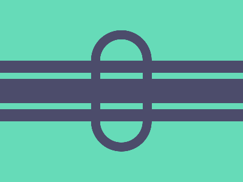

# ✅ CSS Battle Daily Target: 28/04/2025

  
[Play Challenge](https://cssbattle.dev/play/uyVa0X1zsI3rVFTC1h7B)  
[Watch Solution Video](https://youtube.com/shorts/yHKcYYLJ3s8)

---

## 🔢 Stats

**Match**: ✅ 100%  
**Score**: 🟢 635.2 (Characters: 255)

---

## ✅ Code

```html
<p>
<style>
*{
  background:#66DBB8;
  +*{
    border:16q solid#4C4C6B;
    margin:50 150;
    border-radius:52q
  }
} 
  p{
    position:fixed;
    padding:50+200;
    margin:35-165;
    background:#4C4C6B;
    clip-path: polygon(0% 0%, 100% 0%, 100% 20%, 0% 20%, 0% 30%, 100% 30%, 100% 70%, 0% 70%, 0% 80%, 100% 80%, 100% 100%, 0% 100%);
  }
</style>
```

---

## ✅ Code Explanation

This design features a **mint green background** (`#66DBB8`) with a **thick dark gray bordered circle**, and **three horizontal dark gray stripes** passing through the canvas.

---

### 🎨 Background and Main Circle

The universal selector (`*`) sets the entire canvas background to mint green.

Then, using the adjacent sibling selector (`+*`), the next element after the `<p>` tag is styled as the **main circle**.  
This circle is created by applying a thick `16q` dark gray border (`#4C4C6B`) around a transparent center.  
`Margin: 50 150` centers the circle horizontally and vertically.  
`Border-radius: 52q` ensures the shape is perfectly round.

This results in a **hollow circle** with a strong, bold outline effect.

---

### 🛠️ Creating the Horizontal Stripes

The `<p>` tag itself is used to create the **three horizontal bars**.

The `<p>` is positioned using `fixed`, ensuring it stays locked relative to the viewport.  
`Padding: 50+200` and `margin: 35-165` stretch and place the `<p>` properly across the center.

The background color of the `<p>` is set to dark gray (`#4C4C6B`), matching the circle's border.

The magic happens with the `clip-path: polygon(...)`.  
The clip-path divides the `<p>` into three horizontal visible sections:

- The top bar covers the vertical space from 0% to 20%.
- The middle bar covers from 30% to 70%.
- The bottom bar covers from 80% to 100%.

Spaces between these bars are left transparent, making the design look segmented without using multiple divs.

---

### 🧠 Techniques Used

- The **adjacent sibling selector** (`+*`) targets the second element without needing any extra classes or IDs.
- **Fixed positioning** ensures the horizontal bars remain steady across the viewport.
- **Clip-path with polygon points** neatly cuts the `<p>` into three separate bars without adding more elements.
- **Border and border-radius** work together to form a precise circular frame.
- **Minimal HTML structure** keeps the markup extremely light and efficient — just a single `<p>` element used smartly.
