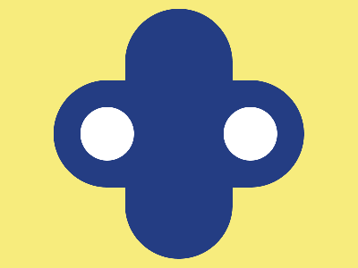

# ✅ CSS Battle Daily Target: 29/04/2025

  
[Play Challenge](https://cssbattle.dev/play/Y0af1NBMZjuPEX46qo7a)  
[Watch Solution Video](https://youtube.com/shorts/EcIMdz-9cGU)

---

## 🔢 Stats

**Match**: ✅ 100%  
**Score**: 🟢 650.56 (Characters: 217)

---

## ✅ Code

```html
<p><a><b>
<style>
*{
  background:#F7EC7D;
  position:fixed
}
 p,a,b{
   background:#243D83;
   padding:140+60;
   margin:2+132;
   border-radius:64q
 } 
  a{
    rotate:90deg;
    margin:-140-60
  }
  b{
    background:#fff;
    padding:30;
    margin:50-30;
    box-shadow:0-169q#FFF
  }
</style>
```

---

## ✅ Code Explanation

This design features a **yellow background** (`#F7EC7D`) with a **blue vertical pill**, a **rotated horizontal blue pill**, and a **white center with a small white circle above it** — creating a shape that looks like a plus sign inside a circle.

---

### 🎨 Background Setup

The universal selector (`*`) sets the background color to bright yellow (`#F7EC7D`) and applies `position: fixed` to all elements.  
Using `fixed` ensures that no matter the scrolling, the elements stay precisely placed within the viewport.

---

### 🛠️ Main Shapes

Three HTML elements are used: `<p>`, `<a>`, and `<b>`, and all three are styled together initially.

- The `<p>`, `<a>`, and `<b>` elements are given the **same blue background** (`#243D83`).
- They are styled with `padding: 140+60` to make them tall and pill-shaped.
- `Margin: 2+132` centers them horizontally and vertically.
- `Border-radius: 64q` makes their corners fully rounded, creating **vertical pills**.

---

### 🔄 Rotating for Horizontal Pill

The `<a>` tag is **rotated** by `90 degrees` using `rotate:90deg`, turning the vertical blue pill into a **horizontal blue pill**.

Its margin is adjusted with `margin: -140 -60` to correctly position it in the center over the vertical one, forming a neat **plus (+) symbol**.

---

### ⚪ White Center and Small White Circle

The `<b>` tag is repurposed:

- Its background is changed to **white** (`#fff`).
- Padding is reduced to `30`, making it a small circle.
- Margin is adjusted to `50 -30` to place it nicely in the center.
- A `box-shadow` is added with `0 -169q #FFF`, which creates a second **white circle above** the existing one.

Thus, `<b>` effectively becomes **two small white circles**, one central and one above — all achieved using just one element via clever use of `box-shadow`.

---

### 🧠 Techniques Used

- **Element reusability** by styling `<p>`, `<a>`, and `<b>` with common and specific tweaks.
- **Fixed positioning** locks elements relative to the viewport.
- **Rotation with `rotate`** creates a horizontal shape without adding new elements.
- **Box-shadow** smartly duplicates the white circle, avoiding extra markup.
- **Border-radius and padding tricks** are used to create pills and circles without extra complication.