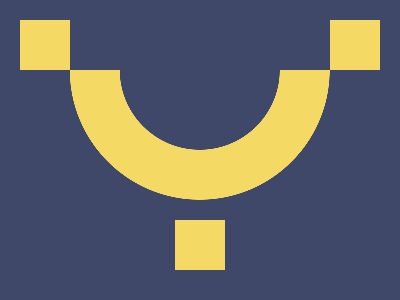

# ✅ CSS Battle Daily Target: 01/05/2025

  
[Play Challenge](https://cssbattle.dev/play/fjhTz4RVqZ0cJTFGtxmE)  
[Watch Solution Video](https://youtube.com/shorts/JHpr4jiZn_s)

---

## 🔢 Stats

**Match**: ✅ 100%  
**Score**: 🟢 660.03 (Characters: 199)

---

## ✅ Code

```html
<p>
<style>
*{
  background:#3F4869;
  color:#F4DA64;
  +*{
    border:53q solid;
    margin:70 70 100;
    border-radius:0 0 140q 140q;
    border-top:0
  }
}
  p{
    position:fixed;
    border:27q solid;
    margin:-50-100;
    box-shadow:328q 0,164q 212q
  }
</style>
```

---

## ✅ Code Explanation

This design features **three yellow semi-circular arches** on a **dark purple background**, resembling a row of stylized domes or the bottom halves of circles.

---

### 🎨 Background and Base Styles

- The outer `*` universal selector sets:
  - `background: #3F4869` → dark purple background.
  - `color: #F4DA64` → yellow, which is used for borders.
- The nested `+*` selector applies to the **second element** (after any element), so it targets the `<style>`’s adjacent sibling — in this case, the single `<p>`:
  - `border: 53q solid` with `color: #F4DA64`, making it yellow.
  - `margin: 70 70 100` for placement.
  - `border-radius: 0 0 140q 140q` creates the **rounded bottom edges**, forming the **semi-circle (arch)** effect.
  - `border-top: 0` removes the top border, making it appear like a bottom-only arch.

---

### 🏛️ Creating the Three Arches

The `<p>` element is used to draw **three arches**:

- `position: fixed` ensures it's placed consistently.
- `border: 27q solid` again uses the inherited `color` for yellow arches.
- `margin: -50 -100` moves the element slightly upward and left.
- `box-shadow:`
  - `328q 0` creates the **second arch** (to the right).
  - `164q 212q` creates the **third arch** (below and centered between the other two).

Together with the base `<p>`, this produces **three yellow half-circles** arranged in a triangular layout.

---

### 🧠 Techniques Used

- **Adjacent sibling selector (`+*`)** is used cleverly to isolate the target shape.
- **Border manipulation** (using `border-top: 0` and `border-radius`) transforms square blocks into smooth domes.
- **Box-shadow** replicates shapes without adding extra HTML — perfect for character optimization.
- **Positioning tricks** (`margin` and `fixed`) place everything precisely without complex layout systems.