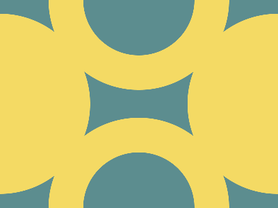

# ✅ CSS Battle Daily Target: 03/05/2025

  
[Play Challenge](https://cssbattle.dev/play/lPS2rJvDHe10t9s3fLQi)  
[Watch Solution Video](https://youtube.com/shorts/wYgqLDUV9_E)

---

## 🔢 Stats

**Match**: ✅ 100%  
**Score**: 🟢 675.45 (Characters: 175)

---

## ✅ Code

```html
<p><a>
<style>
*{
  background:#5C8D8F
}
  p,a{
    position:fixed;
    padding:80;
    border-radius:50%;
    border:53q solid#F4DA64;
    margin:-138 62;
    box-shadow:212q 159q#F4DA64;
  }
  a{
    scale:-1;
    margin:170-130
  }
</style>
```

---

## ✅ Code Explanation

This design consists of **two yellow rings** (donuts) placed diagonally on a **teal-blue background**, creating a simple and elegant composition.

---

### 🌊 Background Setup

The universal selector sets the background color to a muted teal shade. This forms the canvas on which the ring elements will be positioned.

---

### 🟡 Ring Creation with `<p>` and `<a>`

Two HTML elements (`<p>` and `<a>`) are used to render the yellow rings:

* Both are styled as perfect circles using a high `padding` value and `border-radius: 50%`.
* A thick yellow border is applied around them, with no inner fill color (since the element itself is transparent, the center of the ring shows the background).
* Margins are used to shift the rings into their respective positions.
* The first element is moved toward the top-left using a negative margin.

---

### 🪞 Mirroring with `scale: -1`

The `<a>` element acts as a mirrored copy of the first ring:

* The `scale: -1` property is applied, which flips the element both horizontally and vertically.
* Its margin is adjusted in the opposite direction, placing it at the bottom-right corner.

---

### 💡 Creating More Rings with `box-shadow`

Each element also casts a `box-shadow`:

* This shadow is not blurred and uses the **same yellow color** as the border.
* For the first element, the shadow appears toward the bottom-right, forming a **second ring**.
* For the flipped element, the shadow ends up in the **top-left**, maintaining symmetry.

This means each element visually creates **two rings**, but only **two actual HTML elements** are used — keeping the code compact and optimal for character limits.

---

### 🧠 Techniques Used

* Using `padding` and `border-radius` to construct ring shapes without specifying width/height.
* Applying `box-shadow` to clone shapes without adding more elements.
* Leveraging `scale: -1` to mirror an element's layout and shadow.
* Using precise `margin` and `position: fixed` for layout control with minimum code.