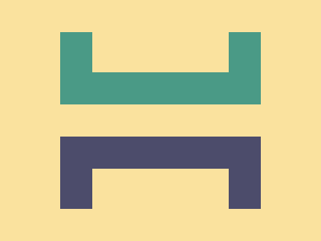

# ✅ CSS Battle Daily Target: 04/05/2025

  
[Play Challenge](https://cssbattle.dev/play/e5B6sphVhoO1v8La01b6)  
[Watch Solution Video](https://youtube.com/shorts/3iNWoe21wUU)

---

## 🔢 Stats

**Match**: ✅ 100%  
**Score**: 🟢 673.33 (Characters: 178)

---

## ✅ Code

```html
<p>
<style>
*{
  background:#FAE29E;
  +*{
    background:linear-gradient(#4A9A86 41%,#FAE29E 0 59%,#4C4C6B 0);
    margin:40 75
  }
}
  p{
    position:fixed;
    padding:25+85;
    margin:0 40;
    box-shadow:0 180q#FAE29E
  }
</style>
```

---

## ✅ Code Explanation

This CSS Battle target creates a **stylized circular shape** with a **color-striped background**, using only one HTML element (`<p>`) and clever CSS layering.

---

### 🎨 Background and Gradient Setup

The universal selector `*` sets the entire canvas background to a **pale yellow** (`#FAE29E`).

Then, the adjacent sibling selector `+*` targets the next element (the `<p>` tag), applying a **vertical linear gradient** as its background. This gradient has three bands:

* Top 41%: **Teal green** (`#4A9A86`)
* Middle 18% (from 41% to 59%): **Pale yellow** (`#FAE29E`) — blending into the background
* Bottom 41%: **Dark blue** (`#4C4C6B`)

The `margin: 40 75` shifts this element slightly downward and centers it horizontally.

---

### 🟡 Central Circle with Shadow

The `<p>` element is absolutely positioned using `position: fixed`.

It uses a combined `padding: 25+85`, which is parsed as `110`, to create a large square. Because there's no content and it later becomes circular, this creates a **donut-like shape**.

`margin: 0 40` centers it horizontally, while vertical positioning is handled by the fixed layout and the `box-shadow`.

The `box-shadow: 0 180q #FAE29E` creates a second identical circle **below** the original, using the same pale yellow as the background to give a seamless duplicated appearance.

---

### 🧠 Techniques Used

* **Universal selector and sibling combinator** to minimize HTML usage and style multiple elements efficiently.
* **Linear gradient** to simulate a background with stacked color bands.
* **Padding-based circles**: Avoids setting width/height explicitly, using `border-radius` via padding.
* **Box-shadow**: Used to visually duplicate the main circle with minimal markup.
* **Character-efficient CSS**: Operators like `+` and units like `q` are used to keep code compact for CSS Battle scoring.
