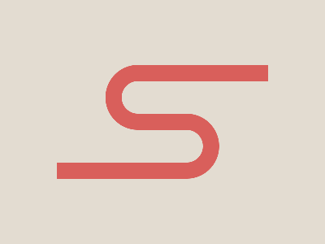

# ✅ CSS Battle Daily Target: 05/05/2025

  
[Play Challenge](https://cssbattle.dev/play/HrjqdWgvZ6qLTBBYQePW)  
[Watch Solution Video](https://youtube.com/shorts/1_6c3BY6VGA)

---

## 🔢 Stats

**Match**: ✅ 100%  
**Score**: 🟢 636.92 (Characters: 250)

---

## ✅ Code

```html
<p><a><b>
<style>
*{
  background:#E3DCD1;
  position:fixed
}
  p,a{
    border:22q solid#D95F5B;
    padding:20+26.5;
    border-radius:42q 0 0 42q;
    margin:72 122;
    border-right:0
  }
  a{
    scale:-1;
    margin:20
  }
  b{
    background:#D95F5B;
    padding:10+80;
    margin:80 -107;
    box-shadow:106q -127q#D95F5B
  }
</style>
```

---

## ✅ Code Explanation

This target creates a **pair of red semi-circular pipes** on a pale beige background with a **horizontal red bar in the center**. The solution uses just three HTML elements (`<p>`, `<a>`, and `<b>`) and clever reuse through mirroring and shadows.

---

### 🎨 Background Setup

The universal selector `*` sets the background to a light beige color (`#E3DCD1`) and applies `position: fixed` to all elements for consistent screen positioning.

---

### 🟥 Left Pipe (`<p>`)

The `<p>` tag renders the **left semi-circular pipe**:

* `border: 22q solid #D95F5B` defines a thick red border.
* `padding: 20+26.5` creates a roughly square size, parsed as `46.5` units.
* `border-radius: 42q 0 0 42q` rounds only the left side, creating a **left-facing semi-circle**.
* `margin: 72 122` positions it centrally.
* `border-right: 0` removes the right border, emphasizing the open pipe effect.

---

### 🟥 Right Pipe (`<a>`)

The `<a>` tag mirrors the `<p>` to form the **right semi-circular pipe**:

* `scale: -1` flips it horizontally and vertically.
* `margin: 20` pulls it into place to the right of the original.
* It inherits the same style from `p,a`, resulting in a mirrored version of the left pipe.

---

### 🟥 Center Horizontal Bar (`<b>`)

The `<b>` tag creates the **horizontal red bar** connecting the two pipes:

* `background: #D95F5B` gives it a solid red fill.
* `padding: 10+80` expands it into a wide horizontal bar.
* `margin: 80 -107` places it horizontally centered.
* `box-shadow: 106q -127q #D95F5B` duplicates the bar at an offset to create a **second horizontal segment**, completing the full bar across both pipes.

---

### 🧠 Techniques Used

* **Fixed positioning** ensures exact placement across elements.
* **Border-radius tricks** to create semi-circles using only one side.
* **Scale flipping** lets you mirror an element without repeating styles.
* **Box-shadow** acts as a free duplicate to reduce extra markup.
* **Smart shorthand and unit usage** (like `q` and `+` math) keep the character count low for CSS Battle scoring.