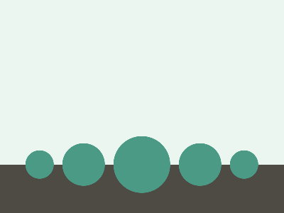

# ✅ CSS Battle Daily Target: 06/05/2025

  
[Play Challenge](https://cssbattle.dev/play/KqqVsiGHvJ8j5uxoMofQ)  
[Watch Solution Video](https://youtube.com/shorts/3RWtKQDCfjU)

---

## 🔢 Stats

**Match**: ✅ 100%  
**Score**: 🟢 643 (Characters: 234)

---

## ✅ Code

```html
<p>
<style>
*{
  background:linear-gradient(#EBF6F0 77.3%,#4E4B44 0);
  margin:0
}
  p{
    position:fixed;
    padding:40;
    background:#4A9A86;
    border-radius:50%;
    margin:192 160;
    box-shadow:87q 0 0 -10px#4A9A86,152q 0 0 -21q#4A9A86;
    -webkit-box-reflect:left -80px
  }
</style>
```

---

## ✅ Code Explanation

This target creates **three teal green circles** aligned horizontally, set against a **two-tone vertical background** — pale green on top and dark brown at the bottom. The solution uses a single HTML tag and advanced CSS techniques to replicate all three circles.

---

### 🎨 Background Setup

The universal selector `*` sets a **linear gradient** background:

* From the top to 77.3%: light green (`#EBF6F0`)
* From 77.3% to bottom: dark brown (`#4E4B44`)

This creates the visual split between sky and ground.

---

### 🟢 Main Circle (`<p>`)

The `<p>` tag draws the **center circle**:

* `position: fixed` allows precise placement.
* `padding: 40` and `border-radius: 50%` create a perfect circle.
* `background: #4A9A86` colors it teal.
* `margin: 192 160` moves it into position near the bottom center.

---

### 🟢 Side Circles via `box-shadow`

Two additional circles are created with `box-shadow`:

* `87q 0 0 -10px #4A9A86` for the **right circle**
* `152q 0 0 -21q #4A9A86` for the **far right (fainter) circle**

  * Negative blur radius (`-10px` and `-21q`) keeps them sharp and controlled.

---

### 🪞 Reflection: `-webkit-box-reflect`

The magic trick:
`-webkit-box-reflect: left -80px` mirrors the entire `<p>` element (and its shadows) to the left — effectively creating **all three circles** (two real, one mirrored).

---

### 🧠 Techniques Used

* **`box-shadow`** for duplicating elements without extra HTML.
* **`-webkit-box-reflect`** to mirror elements horizontally, saving markup.
* **Gradient backgrounds** to simulate layered environments.
* **Fixed layout and shorthand units (`q`, negative blur)** for character optimization in CSS Battle.