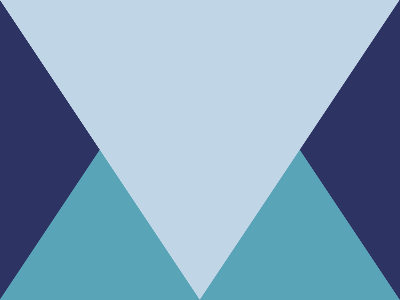

# ✅ CSS Battle Daily Target: 07/05/2025

  
[Play Challenge](https://cssbattle.dev/play/f8tqJI4rjQfoAL8kQrLW)  
[Watch Solution Video](https://youtube.com/shorts/p9BzzNE3vRY)

---

## 🔢 Stats

**Match**: ✅ 100%  
**Score**: 🟢 679.9 (Characters: 169)

---

## ✅ Code

```html
<p><p a>
<style>
*{
  background:#2D3464
}
  p{
    position:fixed;
    padding:150+200;
    background:#5AA4B7;
    clip-path:polygon(50% 0,0% 100%,100% 100%);
    margin:-8
  }
  [a]{
    scale:-1;
    background:#C0D6E7
  }
</style>
```

---

## ✅ Code Explanation

This challenge displays a large, upward-pointing triangle and a mirrored downward one, centered on a deep blue background. It cleverly uses only two HTML elements with flipped styles to achieve the full symmetrical effect.

---

### 🎨 Background

The entire page uses a dark blue color (`#2D3464`) as the background, giving contrast to the triangular shapes.

---

### 🔺 Top Triangle (`<p>`)

The `<p>` tag is styled to form a triangle pointing upward using `clip-path: polygon(50% 0, 0% 100%, 100% 100%)`. Padding (150+200) is used to control the shape’s size, and the triangle is colored with a light blue shade (`#5AA4B7`). Fixed positioning ensures consistent placement, and a small negative margin helps nudge the triangle into the correct spot.

---

### 🔻 Bottom Triangle (`<p a>`)

The second `<p>` tag has an attribute (`a`) that allows it to be targeted with `[a]` in CSS. It inherits the triangle shape but is flipped with `scale: -1`, turning it into a downward-pointing triangle. Its color is changed to a lighter tone (`#C0D6E7`), completing the mirrored reflection.

---

### 🧠 Techniques Used

* `clip-path: polygon` is used to create precise triangle shapes with no extra markup.
* `scale: -1` mirrors the triangle vertically and horizontally, saving characters.
* Attribute selectors like `[a]` help reuse styles with minimal HTML.
* Fixed positioning and minimal negative margin tweak the alignment without adding complexity.