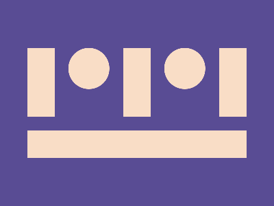

# ✅ CSS Battle Daily Target: 10/05/2025

  
[Play Challenge](https://cssbattle.dev/play/ZSGbEiYniSxtbqb48YXX)  
[Watch Solution Video](https://youtube.com/shorts/TMaog9mabQ0)

---

## 🔢 Stats

**Match**: ✅ 100%  
**Score**: 🟢 641 (Characters: 239)

---

## ✅ Code

```html
<p><a><b>
<style>
*{
  background:#594C94
}
  p,a,b{
    position:fixed;
    background:#F9DDC6;
    padding:20+160;
    margin:182 32;
    color:#F9DDC6
  }
  a{
    padding:50+20;
    margin:-140-160;
    box-shadow:148q 0,296q 0
  }
  b{
    padding:30;
    border-radius:50%;
    margin:-50 40;
    box-shadow:148q 0
  }
</style>
```

---

## ✅ Code Explanation

This target features a **row of three rounded rectangles**, each with a **circle on top**, arranged over a **purple background**. The layout creates the appearance of three stylized lollipops or popsicles with perfectly aligned tops and spacing.

---

### 🎨 Background

The entire canvas is set to a **dark purple background** using the universal selector with `background: #594C94`. This establishes the backdrop and allows the light tan-colored elements to pop visually.

---

### 🟫 Central Popsicle Shape (`<p>`)

The `<p>` tag creates the **central rounded rectangle** (the stick of the popsicle). It uses large vertical `padding` to form a tall shape and a fixed `margin` to center it horizontally. A `color` property is also set, which isn’t strictly necessary, but harmless due to tag inheritance. All popsicles share the same background color: `#F9DDC6` (a pale beige).

---

### 🟫 Side Popsicles (`<a>`)

The `<a>` tag forms **two more identical rectangles**, placed to the left and right of the central one using the `box-shadow` trick. The shape is slightly smaller (shorter padding) and shifted vertically and horizontally using negative `margin`. The shadows are offset by `148q` and `296q`, placing two copies side-by-side across the row.

---

### ⚪ Circles on Top (`<b>`)

The `<b>` tag draws the **circular tops** of the popsicles. It uses equal horizontal and vertical `padding` and a `border-radius: 50%` to form a perfect circle. Like the others, it's placed using negative margins and then duplicated horizontally using a `box-shadow` identical in spacing to the `<a>` tag, so all three tops align perfectly with their corresponding rectangles.

---

### 🧠 Techniques Used

* **Box-shadow replication** saves characters by duplicating shapes horizontally without extra elements.
* **Negative margins** align elements perfectly without flex or grid.
* **Layered stacking with fixed positioning** ensures the elements don't shift during render.
* **Consistent color scheme and spacing** help unify the three distinct shapes into one visual group.