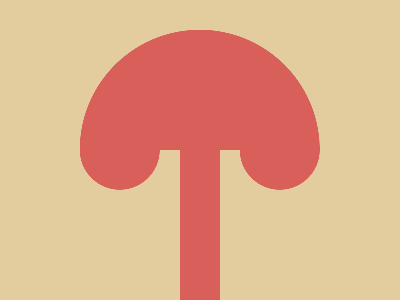

# ✅ CSS Battle Daily Target: 13/05/2025

  
[Play Challenge](https://cssbattle.dev/play/Gdk9p5YZo4u4tNoTYFdE)  
[Watch Solution Video](https://youtube.com/shorts/uqhXZjkHyh0)

---

## 🔢 Stats

**Match**: ✅ 100%  
**Score**: 🟢 646.41 (Characters: 226)

---

## ✅ Code

```html
<p><a><b>
<style>
  *{
    background:#E3CC9E
  }
  p,a,b{
    position:fixed;
    background:#D95F5B
  }
  p{
    padding:80+20;
    margin:132 172
  }
  a,b{
    padding:60+120;
    margin:-190-120;
    border-radius:130q 130q 0 0
  }
  b{
    scale:-0.33;
    margin:20-40;
    box-shadow:514q 0#D95F5B
  }
</style>
```

---

## ✅ Code Explanation

This challenge presents a vertically centered capsule with two semi-circles above it, creating a totem-like structure — all placed over a beige background.

### 🎨 Background

The universal selector applies a light beige color (`#E3CC9E`) to the entire canvas. This forms a soft and neutral base that helps the red elements stand out clearly.

### 🟥 Central Pill (`<p>`)

The `<p>` tag is a vertical rectangle positioned using `fixed`. Padding is used to define its height and width (`80+20`), and it’s moved into place with a margin of `132 172`. The background is set to red (`#D95F5B`), creating the middle section of the totem.

### 🟣 Upper Semi-Circles (`<a>` and `<b>`)

Both `<a>` and `<b>` tags are styled identically with wide horizontal padding (`60+120`) and a top-only border radius (`130q 130q 0 0`), giving them the look of domes or half-circles.

They are moved into place above the `<p>` using negative margins (`-190-120`), causing them to overlap downward over the central rectangle.

### 🔁 Cloning Effect (`<b>`)

The `<b>` tag is scaled down to one-third size using `scale: -0.33`, which also flips it. It’s then offset using `margin: 20-40`, and a clever `box-shadow` (with a massive horizontal offset of `514q`) is used to duplicate the shape to the right. This way, both semicircles appear symmetrically above the center.

### 🧠 Techniques Used

* Multiple HTML tags reused for layered shapes.
* `box-shadow` trick to clone shapes without more HTML.
* `scale` to flip and resize one shape.
* Minimal use of properties like `padding` and `margin` for layout efficiency.
* All elements positioned with `fixed` to control placement tightly.
