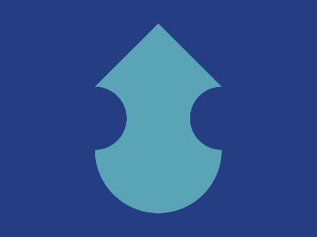

# ✅ CSS Battle Daily Target: 14/05/2025

  
[Play Challenge](https://cssbattle.dev/play/SvJUAVrPpdOCGKiTdbeX)  
[Watch Solution Video](https://youtube.com/shorts/E-xdk_EMQ4U)

---

## 🔢 Stats

**Match**: ✅ 100%  
**Score**: 🟢 643.83 (Characters: 232)

---

## ✅ Code

```html
<p>
<style>
*{
  background:#243D83;
  +*{
    background:#5AA4B7;
    margin:30 120;
    clip-path:polygon(50%0,100%33%,100%100%,0 100%,0 33%);
    border-radius:0 0 100q 100q
  }
}
  p{
    position:fixed;
    padding:40;
    border-radius:50%;
    margin:80-40;
    box-shadow:169q 0#243D83
  }
</style>
```

---

## ✅ Code Explanation

This target features a **blue background** with a **large rounded hexagonal shape** in the center. On top of that sits a **perfect circle**, creating a simple yet elegant composition with just one HTML tag and some clever CSS nesting.

### 🎨 Background and Layout

The universal selector (`*`) sets the canvas background to **dark blue (#243D83)**.

Then, using the adjacent sibling selector (`+*`), the first child of any tag (in this case, the `<p>` element) is automatically styled with:

* A **lighter blue background** (`#5AA4B7`),
* A **custom hexagonal shape** created with `clip-path: polygon(...)`,
* A **bottom curve** applied with `border-radius` to smooth out the lower corners.

This forms the **main hexagonal body** of the target.

### 🟢 Top Circle (`<p>`)

The `<p>` tag is the only element in the HTML. It’s styled with:

* `position: fixed` to place it precisely,
* `padding: 40` to create a perfect **circle** using equal padding on all sides,
* A `border-radius` of 50% to make it a circle,
* A vertical margin to shift it down (`margin: 80 -40`),
* A `box-shadow` with a large horizontal offset (`169q 0`) that duplicates the circle and **places another one far to the right**, off-canvas, to avoid affecting layout.

The visual result is a single circle centered horizontally above the hexagon.

### 🧠 Techniques Used

* **Minimal HTML**: Just one `<p>` element — clean and efficient.
* **Sibling combinator (`+*`)**: Used to style the inner element without adding more tags.
* **`clip-path`**: Defines a complex polygonal shape for the body.
* **Padding-based sizing**: Avoids declaring width and height to reduce character count.
* **`box-shadow` trick**: Used to satisfy CSS Battle’s rendering quirk or to push a duplicate out of view.
