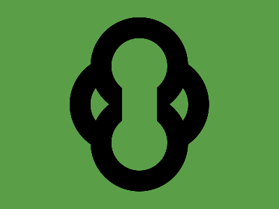

# ✅ CSS Battle Daily Target: 16/05/2025

  
[Play Challenge](https://cssbattle.dev/play/EtLIlg5jRnzB1KqKFiBh)  
[Watch Solution Video](https://youtube.com/shorts/klOEx1bk1D8)

---

## 🔢 Stats

**Match**: ✅ 100%  
**Score**: 🟢 656.15 (Characters: 206)

---

## ✅ Code

```html
<p><a><b><c><d>
<style>
*{
  background:#5A9F48;
  position:fixed;
}
  p,a,b,c{
    border:32q solid#000;
    padding:40;
    border-radius:50%;
    margin:72 92;
  }
  a{
    margin:-70-10
  }
  b{
    margin:-15-100
  }
  c{
    margin:-180-70
  }
  d{
    padding:25;
    margin:30-25
  }
</style>
```

---

## ✅ Code Explanation

The HTML uses a clever nesting trick: `<p><a><b><c><d>`. This gives us five elements to style using only a single HTML tag — a common space-saving tactic in CSS Battle.

---

### 🎨 Global Styles

The universal selector (`*`) applies to all elements:

* Sets the canvas background to **green** (`#5A9F48`).
* Applies `position: fixed` to each element so they can be positioned precisely without being affected by document flow.

---

### ⚫ Four Black Circles – `<p>`, `<a>`, `<b>`, `<c>`

These four elements are styled identically with:

* A thick **black border** (`32q solid #000`) which defines the size of the circles.
* **Padding: 40**, which increases the internal size of each circle.
* `border-radius: 50%` to make them perfectly circular.
* Different `margin` values to control the **positioning** of each circle on the canvas:

  * `<p>` starts at `margin: 72 92`.
  * `<a>` is shifted slightly up and left with `margin: -70 -10`.
  * `<b>` shifts further left with `margin: -15 -100`.
  * `<c>` moves dramatically up and left with `margin: -180 -70`.

These carefully offset margins allow the black circles to form a precise visual composition.

---

### ⚫ Fifth Element – `<d>`

* Only uses **padding: 25** to define its size.
* Positioned with `margin: 30 -25`, placing it slightly lower and to the left of the last circle.
* No `border`, no `border-radius` — which makes it appear as a **solid green dot** (matching the background) that covers part of one of the black circles, forming a cutout or masking effect.

---

### 🧠 Techniques Used

* **Nesting elements** to avoid extra HTML characters.
* **Fixed positioning** for absolute placement.
* **Border trick** to create perfectly circular outlines.
* **Minimal use of colors** — only black and background green.
* **Negative margins** to stack and overlap the circles.
* **Precise spacing** and alignment using shorthand values like `32q`, `40`, and `25`.