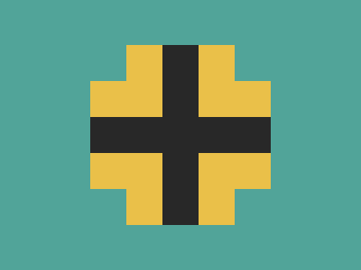

# ✅ CSS Battle Daily Target: 17/05/2025

  
[Play Challenge](https://cssbattle.dev/play/0nqNpNdB9PWRtApFDCX3)  
[Watch Solution Video](https://youtube.com/shorts/Np1wl-ROg60)

---

## 🔢 Stats

**Match**: ✅ 100%  
**Score**: 🟢 669.92 (Characters: 183)

---

## ✅ Code

```html
<p><a>
<style>
*{
  background:#51A499
}
  p,a{
    position:fixed;
    padding:20;
    margin:42 92;
    box-shadow:21q 21q 0 21q#EAC049,42q 42q 0 42q#282828;
    -webkit-box-reflect:right 127q 
  }
  a{
    scale:-1;
    margin:140
  }
</style>
```

---

## ✅ Code Explanation

The markup uses `<p><a>`, which gives us **two stylable elements** with just one HTML tag. This is a common character-saving technique in CSS Battle.

---

### 🎨 Global Styles

The universal selector `*` sets the background to **teal green** (`#51A499`). This color fills the entire canvas.

---

### 🔲 Shared Styles for `<p>` and `<a>`

Both `<p>` and `<a>` are given the same foundational styles:

* `position: fixed` allows elements to be placed exactly where needed.
* `padding: 20` defines the base square size.
* `margin: 42 92` positions the element towards the top center.
* `box-shadow` is used with two shadows:

  * The first shadow (`21q 21q 0 21q #EAC049`) draws a **yellow square** offset diagonally.
  * The second shadow (`42q 42q 0 42q #282828`) creates a **black square** offset even further.
* `-webkit-box-reflect: right 127q` mirrors the entire shape to the right, creating a reflected version spaced out exactly.

This results in **four squares** total from just one element: two original stacked diagonally (yellow and black), and two mirrored versions to the right.

---

### ↩️ Additional Styling for `<a>`

The second element (`<a>`) adds:

* `scale: -1`, which **flips the element vertically**. This inverts the two-square stack.
* `margin: 140`, which moves the flipped structure downward, perfectly positioning it beneath the first element.

---

### 📐 Final Composition

The combination of box shadows, reflection, and flipping produces a **diamond made of four squares**:

* Top-left and bottom-right: yellow
* Top-right and bottom-left: black

Each square aligns diagonally, forming a perfect rotational symmetry.

---

### 🧠 Techniques Used

* **Nesting tags** to minimize HTML characters
* **Box shadows** to create multiple squares from a single element
* **CSS reflection** for duplication without extra markup
* **Vertical flipping** via scale for symmetrical layout
* **Precision spacing** using `q` units for consistent offsets